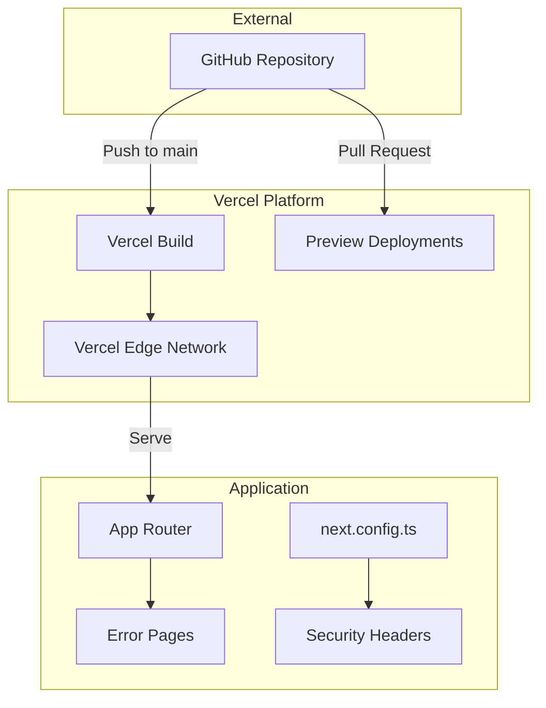
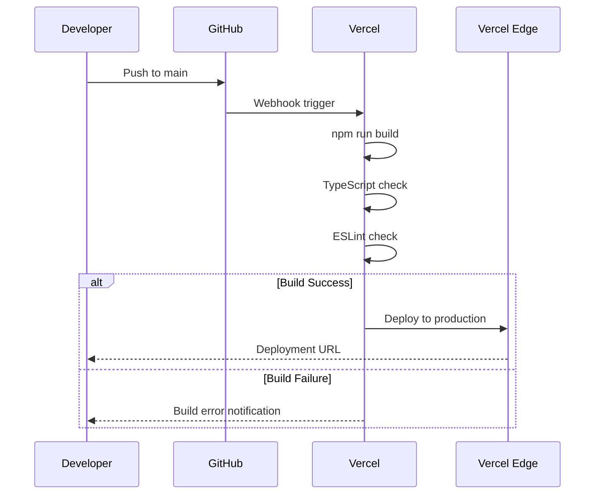
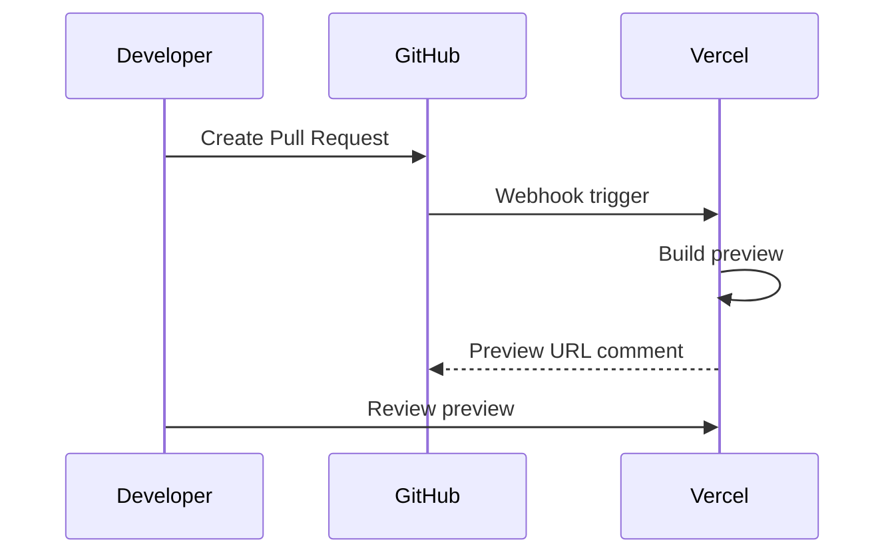

# Design Document: deploy-vercel

## Overview
**Purpose**: エンジニアおみくじWebサービスをVercelプラットフォームにデプロイし、継続的デプロイメントを実現する。

**Users**: 開発者がmainブランチへのマージで自動デプロイを行い、エンドユーザーが本番環境でサービスを利用する。

**Impact**: 既存のNext.js 16アプリケーションにデプロイ設定、セキュリティヘッダー、カスタムエラーページを追加。

### Goals
- Vercelへの自動デプロイ環境構築
- HTTPセキュリティヘッダーによる本番環境の保護
- ユーザーフレンドリーなカスタムエラーページ提供
- Core Web Vitals基準を満たすパフォーマンス維持

### Non-Goals
- カスタムドメイン設定（Vercel管理画面で別途設定）
- Vercel Analytics有料機能の導入
- CI/CDパイプラインのカスタマイズ（Vercel標準を使用）
- CDNキャッシュの詳細チューニング

## Architecture

### Existing Architecture Analysis
- **現在のアーキテクチャ**: Next.js 16 App Router + クリーンアーキテクチャ（DDD準拠）
- **既存パターン**: JSON Repository、API Routes、コンポーネント統合
- **技術的負債**: なし（新規デプロイ設定のため）
- **統合ポイント**: next.config.ts（設定追加）、app/（エラーページ追加）

### Architecture Pattern & Boundary Map



**Architecture Integration**:
- **Selected pattern**: ゼロコンフィグデプロイ（Vercel標準）
- **Domain boundaries**: デプロイ設定はインフラ層、エラーページはプレゼンテーション層
- **Existing patterns preserved**: クリーンアーキテクチャ、デザインシステム
- **New components rationale**: セキュリティヘッダーとエラーページは本番要件
- **Steering compliance**: tech.mdのインフラ・デプロイ仕様に準拠

### Technology Stack

| Layer | Choice / Version | Role in Feature | Notes |
|-------|------------------|-----------------|-------|
| Frontend | Next.js 16.1.1 | App Router、エラーページ | 既存 |
| Infrastructure | Vercel | ホスティング、CDN、自動デプロイ | 新規設定 |
| Configuration | next.config.ts | セキュリティヘッダー定義 | 既存ファイル拡張 |

## System Flows

### デプロイフロー



### プレビューデプロイフロー



## Requirements Traceability

| Requirement | Summary | Components | Interfaces | Flows |
|-------------|---------|------------|------------|-------|
| 1.1-1.5 | Vercelプロジェクト設定 | NextConfig | - | デプロイフロー |
| 2.1-2.3 | 環境変数管理 | EnvExample | - | - |
| 3.1-3.4 | ビルド最適化 | NextConfig | - | デプロイフロー |
| 4.1-4.4 | デプロイワークフロー | - | - | デプロイフロー、プレビューフロー |
| 5.1-5.4 | エラーハンドリング | NotFoundPage, ErrorPage, GlobalErrorPage | - | - |
| 6.1-6.4 | セキュリティ設定 | SecurityHeaders | - | - |

## Components and Interfaces

| Component | Domain/Layer | Intent | Req Coverage | Key Dependencies | Contracts |
|-----------|--------------|--------|--------------|------------------|-----------|
| NextConfig | Infrastructure | セキュリティヘッダー・ビルド設定 | 1.1-1.5, 3.1-3.4, 6.1-6.4 | - | Config |
| NotFoundPage | Presentation | 404エラーページ表示 | 5.1 | ShrineDesignTokens (P1) | UI |
| ErrorPage | Presentation | クライアントエラー表示 | 5.2, 5.3 | ShrineDesignTokens (P1) | UI |
| GlobalErrorPage | Presentation | ルートレベルエラー表示 | 5.2 | - | UI |
| EnvExample | Infrastructure | 環境変数ドキュメント | 2.1-2.3 | - | Documentation |

### Infrastructure Layer

#### NextConfig

| Field | Detail |
|-------|--------|
| Intent | Next.js設定でセキュリティヘッダーとビルドオプションを定義 |
| Requirements | 1.1-1.5, 3.1-3.4, 6.1-6.4 |

**Responsibilities & Constraints**
- HTTPセキュリティヘッダーの定義
- ビルド最適化オプションの設定
- 既存設定との互換性維持

**Dependencies**
- Inbound: Vercel Build Process — ビルド時に読み込み (P0)
- External: Next.js Framework — 設定API (P0)

**Contracts**: Config [x]

##### Configuration Interface
```typescript
import type { NextConfig } from 'next';

interface SecurityHeader {
  key: string;
  value: string;
}

interface HeaderConfig {
  source: string;
  headers: SecurityHeader[];
}

const nextConfig: NextConfig = {
  headers: async (): Promise<HeaderConfig[]> => {
    return [
      {
        source: '/(.*)',
        headers: [
          { key: 'X-Frame-Options', value: 'DENY' },
          { key: 'X-Content-Type-Options', value: 'nosniff' },
          { key: 'Referrer-Policy', value: 'strict-origin-when-cross-origin' },
          { key: 'Strict-Transport-Security', value: 'max-age=31536000; includeSubDomains' },
        ],
      },
    ];
  },
};
```

**Implementation Notes**
- Integration: 既存next.config.tsを拡張、既存設定を保持
- Validation: ローカルビルドでヘッダー適用を確認
- Risks: ヘッダー設定ミスによるセキュリティ脆弱性

### Presentation Layer

#### NotFoundPage

| Field | Detail |
|-------|--------|
| Intent | 存在しないページアクセス時のカスタム404ページ表示 |
| Requirements | 5.1 |

**Responsibilities & Constraints**
- ユーザーフレンドリーな404メッセージ表示
- トップページへのナビゲーション提供
- 既存デザインシステムとの一貫性

**Dependencies**
- Inbound: App Router — ルーティングエラー時 (P0)
- Outbound: ShrineDesignTokens — スタイリング (P1)

**Contracts**: UI [x]

##### Component Interface
```typescript
// app/not-found.tsx
export default function NotFound(): React.ReactElement;
```
- Preconditions: App Routerが存在しないルートを検出
- Postconditions: 404ページがレンダリングされる

**Implementation Notes**
- Integration: app/not-found.tsx として配置（App Router規約）
- Validation: 存在しないURLアクセスで表示確認

#### ErrorPage

| Field | Detail |
|-------|--------|
| Intent | ランタイムエラー発生時のクライアントサイドエラー表示 |
| Requirements | 5.2, 5.3 |

**Responsibilities & Constraints**
- エラーメッセージの表示
- リトライ機能の提供
- エラーバウンダリとして機能

**Dependencies**
- Inbound: App Router — ランタイムエラー時 (P0)
- Outbound: ShrineDesignTokens — スタイリング (P1)

**Contracts**: UI [x]

##### Component Interface
```typescript
// app/error.tsx
'use client';

interface ErrorPageProps {
  error: Error & { digest?: string };
  reset: () => void;
}

export default function Error(props: ErrorPageProps): React.ReactElement;
```
- Preconditions: コンポーネントツリー内でエラーがスローされる
- Postconditions: エラーページがレンダリングされ、resetでリトライ可能

**Implementation Notes**
- Integration: app/error.tsx として配置、`'use client'`必須
- Validation: 意図的なエラースローで動作確認

#### GlobalErrorPage

| Field | Detail |
|-------|--------|
| Intent | ルートレイアウトレベルのエラー表示 |
| Requirements | 5.2 |

**Responsibilities & Constraints**
- ルートレイアウトのエラーをキャッチ
- 最小限のHTMLで表示（レイアウト外）

**Dependencies**
- Inbound: App Router — ルートレベルエラー時 (P0)

**Contracts**: UI [x]

##### Component Interface
```typescript
// app/global-error.tsx
'use client';

interface GlobalErrorProps {
  error: Error & { digest?: string };
  reset: () => void;
}

export default function GlobalError(props: GlobalErrorProps): React.ReactElement;
```

**Implementation Notes**
- Integration: app/global-error.tsx として配置
- Validation: ルートレイアウトエラーシミュレーションで確認
- Risks: html/bodyタグを自前で提供する必要あり

### Documentation

#### EnvExample

| Field | Detail |
|-------|--------|
| Intent | 環境変数の使用方法を文書化 |
| Requirements | 2.1-2.3 |

**Responsibilities & Constraints**
- 必要な環境変数のテンプレート提供
- 機密情報を含まない

**Implementation Notes**
- Integration: .env.example として配置
- 現時点で必須環境変数なし、将来の拡張に備えたプレースホルダー

## Error Handling

### Error Strategy
- **404エラー**: NotFoundPageで専用UI表示、トップページへの導線提供
- **ランタイムエラー**: ErrorPageでエラーメッセージ表示、リトライボタン提供
- **ルートエラー**: GlobalErrorPageで最小限のフォールバック表示

### Error Categories and Responses
- **User Errors (404)**: 存在しないページ → 404ページ表示、トップへのリンク
- **System Errors (500)**: サーバーエラー → error.tsx でキャッチ、リトライ提供
- **Root Errors**: レイアウトエラー → global-error.tsx でフォールバック

### Monitoring
- Vercel Analyticsで基本的なエラー監視
- ビルドエラーはVercelダッシュボードで通知

## Testing Strategy

### Unit Tests
- セキュリティヘッダー設定値の検証（next.config.ts）
- エラーページコンポーネントのレンダリングテスト

### Integration Tests
- 404ページの表示確認（存在しないルートアクセス）
- エラーページのリトライ機能動作確認

### E2E Tests
- 存在しないURLへのアクセスで404ページ表示
- ビルド成功の確認（npm run build）

## Security Considerations

### HTTPセキュリティヘッダー
本機能で設定するヘッダーとその目的:

| Header | Value | Purpose |
|--------|-------|---------|
| X-Frame-Options | DENY | クリックジャッキング防止 |
| X-Content-Type-Options | nosniff | MIMEスニッフィング防止 |
| Referrer-Policy | strict-origin-when-cross-origin | リファラー情報制御 |
| Strict-Transport-Security | max-age=31536000; includeSubDomains | HTTPS強制 |

### 環境変数保護
- .gitignoreで.env*を除外（既存設定確認済み）
- Vercel環境変数はダッシュボードで管理
- .env.exampleに機密情報を含めない

## Performance & Scalability

### Target Metrics
- Core Web Vitals準拠（LCP < 2.5s、FID < 100ms、CLS < 0.1）
- ビルド時間: 現在のビルド時間を維持

### Optimization Techniques
- ソースマップ非生成（デフォルト）
- 静的アセット圧縮（デフォルト）
- Vercel Edge Networkによるグローバル配信
