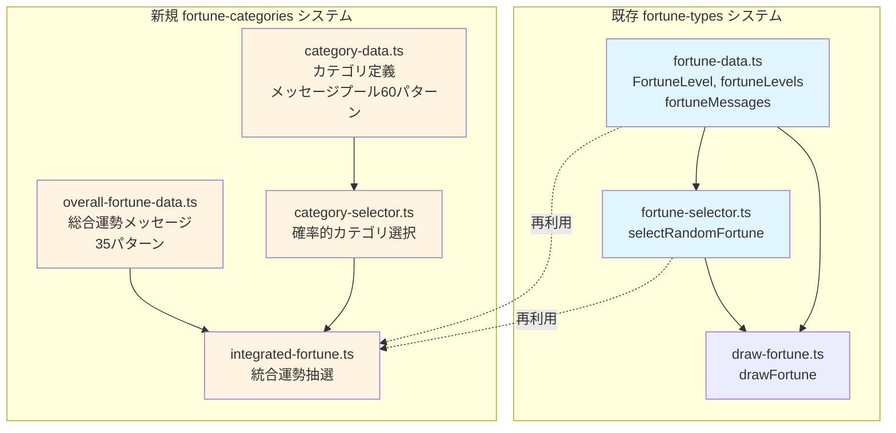
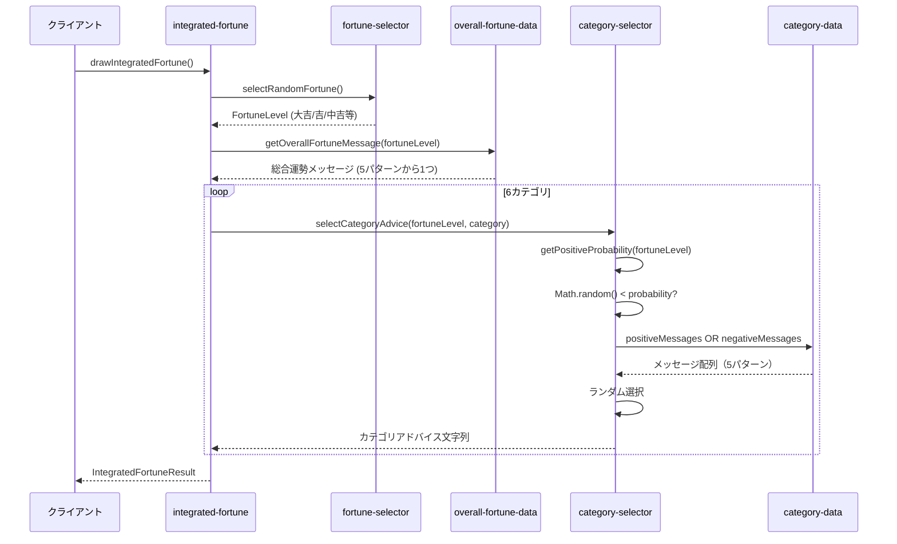
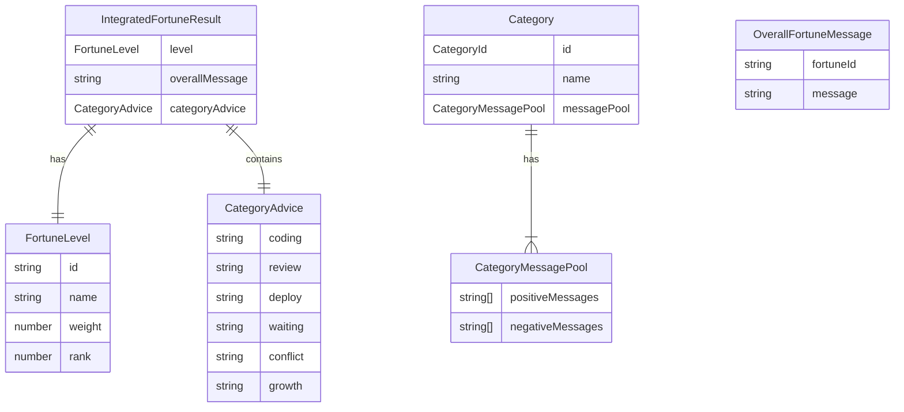

# Design Document

## Overview

**Purpose**: この機能は、既存の運勢システムを拡張し、伝統的なおみくじ形式（総合運勢 + カテゴリ別アドバイス）を提供する。エンジニアユーザーに対して、総合運勢（7段階）と6つのカテゴリ別運勢アドバイス（コーディング、レビュー、デプロイ、待ち人、争い事、成長）を表示し、毎回異なる組み合わせのリアルなおみくじ体験を実現する。

**Users**: ソフトウェアエンジニアがWebアプリケーションでおみくじを引く際に、業務に関連した具体的な運勢アドバイスを受け取る。

**Impact**: 既存のfortune-typesシステム（4種類のおみくじタイプ）を保持しつつ、新規に伝統的おみくじ形式を追加する。既存のFortuneLevel型とselectRandomFortune()関数を再利用し、/lib/ディレクトリに新規モジュールを追加する。

### Goals
- 総合運勢（7段階）と6カテゴリ別アドバイスを含む伝統的おみくじ形式の実装
- 運勢レベルに応じた確率的メッセージ選択（大吉95% positive → 大凶5% positive）
- 既存fortune-typesシステムとの統合とコード再利用（FortuneLevel、selectRandomFortune）
- 2ms以下での統合処理完了（総合運勢抽選 + カテゴリ選択）
- TDD方式による型安全で保守性の高い実装

### Non-Goals
- UI実装（別specで対応）
- 既存の4種類おみくじタイプ（daily-luck、code-review、bug-encounter、deploy-luck）の変更
- ユーザー別運勢の保存・履歴管理機能
- カテゴリの動的追加・カスタマイズ機能

## Architecture

### Existing Architecture Analysis

**現在の実装状況**:
- `/lib/fortune-data.ts`: FortuneLevel型、fortuneLevels配列（7段階）、fortuneMessages配列（28パターン）
- `/lib/fortune-selector.ts`: selectRandomFortune()関数（重み付き確率選択）
- `/lib/draw-fortune.ts`: drawFortune()統合関数
- すべてイミュータブルなデータ構造（`as const`, `readonly`）と純粋関数として実装済み
- 88テストパス済み（ユニット、統合、パフォーマンステスト）

**保持すべきパターン**:
- 運勢レベルの定義（fortuneLevels）と確率分布（16%, 23%, 34%, 12%, 8%, 4%, 3%）
- 重み付き確率選択ロジック（selectRandomFortune）
- イミュータブルなデータ構造（`as const`, `readonly`）
- 純粋関数実装（副作用なし）
- TDD方式（RED-GREEN-REFACTOR-VERIFY）

**統合ポイント**:
- FortuneLevel型を総合運勢レベルの型として再利用
- selectRandomFortune()を総合運勢の抽選に使用
- 既存のfortuneMessagesとは独立した新規メッセージデータを作成

### Architecture Pattern & Boundary Map



**Architecture Integration**:
- **選択パターン**: レイヤードアーキテクチャ（Data Layer → Logic Layer → Integration Layer）
- **Domain/Feature境界**:
  - fortune-types: おみくじタイプ別メッセージシステム（既存）
  - fortune-categories: 伝統的おみくじ形式システム（新規）
  - 両者はFortuneLevel型を共有するが、メッセージデータとロジックは独立
- **既存パターン保持**: イミュータブルデータ、純粋関数、TDD、型安全性
- **新規コンポーネント理由**:
  - `overall-fortune-data.ts`: 総合運勢メッセージ（35パターン、古風な言い回し）を既存fortuneMessagesと分離
  - `category-data.ts`: カテゴリ定義とメッセージプール（60パターン）を管理
  - `category-selector.ts`: 確率的選択ロジックを独立したモジュールとして実装
  - `integrated-fortune.ts`: 総合運勢 + カテゴリアドバイスの統合関数
- **Steering準拠**: structure.mdの「Flat Structure」「Colocation」「Pure Functions」「Data Immutability」原則に合致

### Technology Stack

| Layer | Choice / Version | Role in Feature | Notes |
|-------|------------------|-----------------|-------|
| Language | TypeScript (strict mode) | 型安全なデータ構造とロジック実装 | すべての実装でstrict mode準拠 |
| Testing | Jest 30.2.0 | ユニット、統合、パフォーマンステスト | /lib/__tests__/に配置 |
| Data Structure | `as const`, `readonly` | イミュータブルなマスターデータ | fortuneLevelsパターンを踏襲 |
| Runtime | Node.js 24.12.0 | 純粋関数実行環境 | Voltaで固定 |

## Requirements Traceability

| Requirement | Summary | Components | Interfaces | Flows |
|-------------|---------|------------|------------|-------|
| 1 | 総合運勢の表示（7段階、各5パターン） | overall-fortune-data, integrated-fortune | OverallFortuneMessage[], drawIntegratedFortune | 総合運勢抽選フロー |
| 2 | 運勢カテゴリの定義（6カテゴリ） | category-data | Category[], CATEGORY_IDS | - |
| 3 | メッセージプールの構成（positive/negative各5） | category-data | CategoryMessagePool | - |
| 4 | 確率的メッセージ選択（95%→5%） | category-selector | selectCategoryAdvice, getPositiveProbability | カテゴリ選択フロー |
| 5 | 運勢結果のデータ構造 | integrated-fortune | IntegratedFortuneResult, CategoryAdvice | - |
| 6 | 既存システムとの統合 | integrated-fortune | FortuneLevel再利用, selectRandomFortune再利用 | 統合フロー |
| 7 | 技術的制約（TypeScript strict, TDD） | 全コンポーネント | - | - |
| 8 | パフォーマンス（2ms以下） | category-selector, integrated-fortune | - | パフォーマンステスト |

## System Flows

### 統合運勢抽選フロー



**フロー決定事項**:
- 総合運勢レベルは既存のselectRandomFortune()で決定（重み付き確率）
- 総合運勢メッセージは5パターンからランダム選択（毎回異なる表現）
- 各カテゴリアドバイスは独立して確率判定（カテゴリ間に依存関係なし）
- 確率判定 → プール選択 → ランダム選択の3段階処理

## Components and Interfaces

| Component | Domain/Layer | Intent | Req Coverage | Key Dependencies (P0/P1) | Contracts |
|-----------|--------------|--------|--------------|--------------------------|-----------|
| overall-fortune-data | Data Layer | 総合運勢メッセージマスターデータ | 1 | fortune-data (P0) | Data |
| category-data | Data Layer | カテゴリ定義とメッセージプール | 2, 3 | - | Data |
| category-selector | Logic Layer | 確率的カテゴリアドバイス選択 | 4, 8 | category-data (P0), fortune-data (P0) | Service |
| integrated-fortune | Integration Layer | 統合運勢抽選 | 5, 6, 7 | fortune-selector (P0), overall-fortune-data (P0), category-selector (P0) | Service |

### Data Layer

#### overall-fortune-data

| Field | Detail |
|-------|--------|
| Intent | 総合運勢メッセージのマスターデータ提供（7運勢レベル × 5パターン = 35メッセージ） |
| Requirements | 1 |

**Responsibilities & Constraints**
- 7段階の運勢レベルに対し各5パターンの古風な言い回しメッセージを保持
- イミュータブルなデータ構造（`as const`, `readonly`）
- 運勢レベルIDとメッセージの対応関係を保証
- メッセージは100文字程度の長さ

**Dependencies**
- Inbound: integrated-fortune — 総合運勢メッセージ取得 (P0)
- Outbound: fortune-data.FortuneLevel — 運勢レベルIDの型参照 (P0)

**Contracts**: Data [x]

##### Data Model
```typescript
/**
 * 総合運勢メッセージを表すインターフェース
 */
export interface OverallFortuneMessage {
  fortuneId: string;  // FortuneLevel.idに対応（'daikichi', 'kichi', etc.）
  message: string;    // 古風な言い回しのメッセージ（100文字程度）
}

/**
 * 総合運勢メッセージのマスターデータ（35パターン）
 */
export const overallFortuneMessages: readonly OverallFortuneMessage[] = [
  // 大吉 × 5パターン
  { fortuneId: 'daikichi', message: '大いなる吉兆なり。今日の業務、すべて順調に運び...' },
  { fortuneId: 'daikichi', message: '誠に目出度き日なり。コードも思うがまま進み...' },
  // ... 残り33パターン
] as const;

/**
 * 運勢レベルIDから総合運勢メッセージを取得（5パターンからランダム選択）
 */
export function getOverallFortuneMessage(fortuneId: string): string;
```

**Implementation Notes**
- Integration: FortuneLevel.idをキーとして使用
- Validation: fortuneId検証（不正なIDの場合はエラー）、全35メッセージの存在確認テスト
- Risks: メッセージ品質の一貫性（古風な言い回しスタイルガイド必要）

#### category-data

| Field | Detail |
|-------|--------|
| Intent | カテゴリ定義とpositive/negativeメッセージプールの提供 |
| Requirements | 2, 3 |

**Responsibilities & Constraints**
- 6カテゴリ（コーディング、レビュー、デプロイ、待ち人、争い事、成長）の定義
- 各カテゴリにpositive/negative各5メッセージ（計60パターン）
- イミュータブルなデータ構造
- メッセージは3-10文字程度の短いアドバイス形式
- エンジニア業務のあるあるとユーモアを含む

**Dependencies**
- Inbound: category-selector — メッセージプール参照 (P0)

**Contracts**: Data [x]

##### Data Model
```typescript
/**
 * カテゴリ識別子
 */
export type CategoryId =
  | 'coding'      // コーディング運
  | 'review'      // レビュー運
  | 'deploy'      // デプロイ運
  | 'waiting'     // 待ち人
  | 'conflict'    // 争い事
  | 'growth';     // 成長運

/**
 * カテゴリメッセージプール
 */
export interface CategoryMessagePool {
  positiveMessages: readonly string[];  // 5パターン
  negativeMessages: readonly string[];  // 5パターン
}

/**
 * カテゴリ定義
 */
export interface Category {
  id: CategoryId;
  name: string;  // 表示名（例: "コーディング運"）
  messagePool: CategoryMessagePool;
}

/**
 * カテゴリマスターデータ（6カテゴリ）
 */
export const categories: readonly Category[] = [
  {
    id: 'coding',
    name: 'コーディング運',
    messagePool: {
      positiveMessages: [
        'スムーズに進む',
        '実装が捗る',
        'バグなく書ける',
        'リファクタ日和',
        'コードが美しい',
      ],
      negativeMessages: [
        '要件を注意深く',
        '設計を見直せ',
        '焦らず慎重に',
        'テストを先に書け',
        '明日にするがよい',
      ],
    },
  },
  // ... 残り5カテゴリ
] as const;

/**
 * カテゴリID配列（型安全な反復処理用）
 */
export const CATEGORY_IDS: readonly CategoryId[] = [
  'coding',
  'review',
  'deploy',
  'waiting',
  'conflict',
  'growth',
] as const;
```

**Implementation Notes**
- Integration: CATEGORY_IDS配列でループ処理が型安全に実行可能
- Validation: 各カテゴリのpositive/negative各5メッセージの存在確認、メッセージ長チェック（3-10文字）
- Risks: メッセージのユーモアと実用性のバランス（ユーザーフィードバックで調整）

### Logic Layer

#### category-selector

| Field | Detail |
|-------|--------|
| Intent | 運勢レベルに応じた確率的カテゴリアドバイス選択 |
| Requirements | 4, 8 |

**Responsibilities & Constraints**
- 運勢レベルごとの確率マッピング（大吉95% → 大凶5%）
- 独立した確率判定（カテゴリ間で影響なし）
- positive/negativeメッセージプールからのランダム選択
- 1ms以下での処理完了（パフォーマンス要件）

**Dependencies**
- Inbound: integrated-fortune — カテゴリアドバイス取得 (P0)
- Outbound: category-data.Category — メッセージプール参照 (P0)
- Outbound: fortune-data.FortuneLevel — 運勢レベル情報 (P0)

**Contracts**: Service [x]

##### Service Interface
```typescript
/**
 * 運勢レベルに応じたpositive確率を返す
 *
 * @param fortuneLevel - 運勢レベル
 * @returns positive確率（0.0 - 1.0）
 */
export function getPositiveProbability(fortuneLevel: FortuneLevel): number;

/**
 * 運勢レベルとカテゴリから確率的にアドバイスを選択
 *
 * @param fortuneLevel - 運勢レベル
 * @param category - カテゴリ定義
 * @returns 選択されたアドバイスメッセージ
 */
export function selectCategoryAdvice(
  fortuneLevel: FortuneLevel,
  category: Category
): string;
```

**確率マッピング定義**:
```typescript
const POSITIVE_PROBABILITY_MAP: Record<string, number> = {
  'daikichi': 0.95,   // 大吉
  'kichi': 0.80,      // 吉
  'chukichi': 0.65,   // 中吉
  'shokichi': 0.55,   // 小吉
  'suekichi': 0.50,   // 末吉（完全ランダム）
  'kyo': 0.20,        // 凶
  'daikyo': 0.05,     // 大凶
} as const;
```

- Preconditions: fortuneLevelは有効なFortuneLevel型、categoryは有効なCategory型
- Postconditions: 3-10文字のアドバイスメッセージ文字列を返す
- Invariants: 同じ入力に対して確率分布は一定（統計的に検証可能）

**Implementation Notes**
- Integration: integrated-fortuneから6回呼び出される（カテゴリごとに1回）
- Validation: 確率分布の統計的検証（10,000回抽選で±2%以内）、各カテゴリ独立性の確認
- Risks: Math.random()の品質に依存（Node.jsのデフォルト実装で十分）

### Integration Layer

#### integrated-fortune

| Field | Detail |
|-------|--------|
| Intent | 総合運勢抽選とカテゴリアドバイス選択を統合した結果提供 |
| Requirements | 5, 6, 7, 8 |

**Responsibilities & Constraints**
- 総合運勢レベルの抽選（selectRandomFortune再利用）
- 総合運勢メッセージの取得（5パターンからランダム選択）
- 6カテゴリアドバイスの選択（確率的）
- 統合結果オブジェクトの生成
- 2ms以下での処理完了

**Dependencies**
- Inbound: UI層（将来実装） — 統合運勢結果取得 (P0)
- Outbound: fortune-selector.selectRandomFortune — 総合運勢レベル抽選 (P0)
- Outbound: overall-fortune-data.getOverallFortuneMessage — 総合運勢メッセージ取得 (P0)
- Outbound: category-selector.selectCategoryAdvice — カテゴリアドバイス選択 (P0)
- Outbound: category-data.categories, CATEGORY_IDS — カテゴリ情報 (P0)

**Contracts**: Service [x]

##### Service Interface
```typescript
/**
 * カテゴリ別アドバイスを表すインターフェース
 */
export interface CategoryAdvice {
  coding: string;      // コーディング運
  review: string;      // レビュー運
  deploy: string;      // デプロイ運
  waiting: string;     // 待ち人
  conflict: string;    // 争い事
  growth: string;      // 成長運
}

/**
 * 統合運勢結果を表すインターフェース
 */
export interface IntegratedFortuneResult {
  level: FortuneLevel;           // 総合運勢レベル
  overallMessage: string;        // 総合運勢メッセージ（古風な言い回し）
  categoryAdvice: CategoryAdvice; // 6カテゴリのアドバイス
}

/**
 * 統合運勢を抽選し、総合運勢とカテゴリアドバイスを返す
 *
 * @returns 総合運勢レベル、メッセージ、6カテゴリアドバイスを含む結果
 */
export function drawIntegratedFortune(): IntegratedFortuneResult;
```

- Preconditions: なし（引数なし）
- Postconditions: IntegratedFortuneResult型オブジェクトを返す、すべてのフィールドが有効な値
- Invariants: 処理は2ms以下で完了、純粋関数（同じ確率分布を保証）

**Implementation Notes**
- Integration: 既存fortune-selectorのselectRandomFortune()を再利用し、既存システムとの整合性を保つ
- Validation: TypeScript strict modeでの型チェック、統合テストで全フィールド検証、パフォーマンステスト（2ms以下）
- Risks: 依存モジュールのエラー伝播（各モジュールでバリデーション実装）

## Data Models

### Domain Model

**Aggregates and Boundaries**:
- **統合運勢Aggregate**: IntegratedFortuneResult（総合運勢レベル + 総合運勢メッセージ + 6カテゴリアドバイス）
- **カテゴリAggregate**: Category（カテゴリID + 名前 + メッセージプール）

**Entities**:
- FortuneLevel（既存、再利用）: 運勢レベルエンティティ
- OverallFortuneMessage: 総合運勢メッセージエンティティ
- Category: カテゴリエンティティ

**Value Objects**:
- CategoryAdvice: 6カテゴリのアドバイス文字列を持つ値オブジェクト
- CategoryMessagePool: positive/negativeメッセージ配列を持つ値オブジェクト

**Business Rules & Invariants**:
- 運勢レベルは常に7段階のいずれか（大吉、吉、中吉、小吉、末吉、凶、大凶）
- 各カテゴリアドバイスは3-10文字のメッセージ
- 総合運勢メッセージは100文字程度
- 確率分布は運勢レベルごとに固定（大吉95% → 大凶5%）

### Logical Data Model

**Structure Definition**:



**Relationships**:
- IntegratedFortuneResult 1:1 FortuneLevel（総合運勢レベル）
- IntegratedFortuneResult 1:1 CategoryAdvice（6カテゴリアドバイス）
- Category 1:1 CategoryMessagePool（メッセージプール）
- OverallFortuneMessage N:1 FortuneLevel（fortuneIdで関連）

**Consistency & Integrity**:
- トランザクション境界: すべて読み取り専用データ（マスターデータ）、トランザクション不要
- イミュータビリティ: すべてのデータは`as const`と`readonly`で不変性を保証
- 参照整合性: fortuneIdはFortuneLevel.idに対応、TypeScriptの型システムで保証

## Error Handling

### Error Strategy

すべてのコンポーネントは純粋関数として実装され、マスターデータのみを使用するため、エラーは主にデータ検証とプログラミングミスに起因する。

### Error Categories and Responses

**User Errors (4xx)**:
- このシステムではユーザー入力を受け取らないため該当なし（将来のUI層で対応）

**System Errors (5xx)**:
- **データ整合性エラー**: fortuneIdが不正、メッセージが見つからない
  - Response: Error例外をスロー、呼び出し元でキャッチ
  - Mitigation: テストで全データパターンを検証、TypeScript strict modeで型チェック

**Business Logic Errors (422)**:
- 該当なし（ビジネスルール違反が発生する入力がない）

**Validation Errors**:
```typescript
// overall-fortune-data.ts
export function getOverallFortuneMessage(fortuneId: string): string {
  const messages = overallFortuneMessages.filter(m => m.fortuneId === fortuneId);
  if (messages.length === 0) {
    throw new Error(`No overall fortune message found for fortuneId: "${fortuneId}"`);
  }
  return messages[Math.floor(Math.random() * messages.length)].message;
}

// category-selector.ts
export function getPositiveProbability(fortuneLevel: FortuneLevel): number {
  const probability = POSITIVE_PROBABILITY_MAP[fortuneLevel.id];
  if (probability === undefined) {
    throw new Error(`Unknown fortune level ID: "${fortuneLevel.id}"`);
  }
  return probability;
}
```

### Monitoring

- **Error Tracking**: テスト時のエラーログ（Jest出力）
- **Logging**: 本番環境ではエラー発生時にスタックトレースを記録（将来実装）
- **Health Monitoring**: パフォーマンステストで処理時間を継続的に監視（2ms閾値）

## Testing Strategy

### Unit Tests

1. **overall-fortune-data.ts**
   - 全7運勢レベルに対し5パターンずつ計35メッセージが存在することを検証
   - getOverallFortuneMessage()が有効なfortuneIdで正常動作することを確認
   - 不正なfortuneIdでエラーをスローすることを確認

2. **category-data.ts**
   - 全6カテゴリが定義されていることを検証
   - 各カテゴリのpositive/negative各5メッセージが存在することを確認
   - メッセージ長が3-10文字であることを確認

3. **category-selector.ts**
   - getPositiveProbability()が各運勢レベルに対し正しい確率を返すことを確認
   - selectCategoryAdvice()がpositive/negativeメッセージを返すことを確認
   - 不正なfortuneLevelでエラーをスローすることを確認

4. **integrated-fortune.ts**
   - drawIntegratedFortune()がIntegratedFortuneResult型を返すことを確認
   - level、overallMessage、categoryAdviceすべてのフィールドが有効な値であることを検証
   - 6カテゴリアドバイスがすべて設定されていることを確認

### Integration Tests

1. **統合運勢抽選フロー**
   - drawIntegratedFortune()を呼び出し、fortuneLevelが既存fortuneLevelsのいずれかであることを確認
   - overallMessageが対応する運勢レベルのメッセージであることを確認
   - categoryAdviceの各フィールドが該当カテゴリのメッセージプールから選ばれていることを確認

2. **既存システムとの統合**
   - selectRandomFortune()が返すFortuneLevelがintegrated-fortuneで正常に使用できることを確認
   - fortuneLevels配列との整合性を確認

3. **確率的選択の独立性**
   - 複数回drawIntegratedFortune()を実行し、カテゴリ間でpositive/negativeの組み合わせが多様であることを確認

### Performance Tests

1. **カテゴリアドバイス選択速度**
   - selectCategoryAdvice()を1,000回実行し、平均実行時間が1ms以下であることを確認

2. **統合運勢抽選速度**
   - drawIntegratedFortune()を1,000回実行し、平均実行時間が2ms以下であることを確認

3. **メモリリーク検証**
   - drawIntegratedFortune()を1,000回連続実行し、メモリリークが発生しないことを確認

4. **確率分布の統計的検証**
   - 各運勢レベルに対して10,000回selectCategoryAdvice()を実行
   - positive選択率が期待確率±2%以内であることを確認
   - 大吉: 95%±2%, 吉: 80%±2%, 中吉: 65%±2%, 小吉: 55%±2%, 末吉: 50%±2%, 凶: 20%±2%, 大凶: 5%±2%

## Performance & Scalability

### Target Metrics

| Metric | Target | Measurement Strategy |
|--------|--------|---------------------|
| カテゴリアドバイス選択時間 | 1ms以下 | Jestパフォーマンステスト（1,000回実行の平均） |
| 統合運勢抽選時間 | 2ms以下 | Jestパフォーマンステスト（1,000回実行の平均） |
| メモリ使用量 | 増加なし | 1,000回連続実行でメモリリークなし |
| 確率分布精度 | ±2%以内 | 10,000回抽選の統計的検証 |

### Optimization Techniques

- **事前計算**: カテゴリデータとメッセージを`as const`で事前定義、実行時の計算なし
- **純粋関数**: 副作用なし、JITコンパイラ最適化が有効
- **配列アクセス最適化**: Math.floor(Math.random() * length)による直接インデックスアクセス
- **イミュータブルデータ**: 配列コピー不要、参照のみで処理

## Implementation Notes

**ファイル配置**:
- `/lib/overall-fortune-data.ts`
- `/lib/category-data.ts`
- `/lib/category-selector.ts`
- `/lib/integrated-fortune.ts`
- `/lib/__tests__/overall-fortune-data.test.ts`
- `/lib/__tests__/category-data.test.ts`
- `/lib/__tests__/category-selector.test.ts`
- `/lib/__tests__/integrated-fortune.test.ts`

**TDD実装順序**:
1. overall-fortune-data（データ定義 → テスト → 実装）
2. category-data（データ定義 → テスト → 実装）
3. category-selector（テスト → 実装 → リファクタ）
4. integrated-fortune（テスト → 実装 → リファクタ）

**品質保証**:
- TypeScript strict modeでコンパイルエラーなし
- ESLint (eslint-config-next) でwarningなし
- 全テストパス（ユニット、統合、パフォーマンス）
- カバレッジ100%（全コードパスをテスト）
