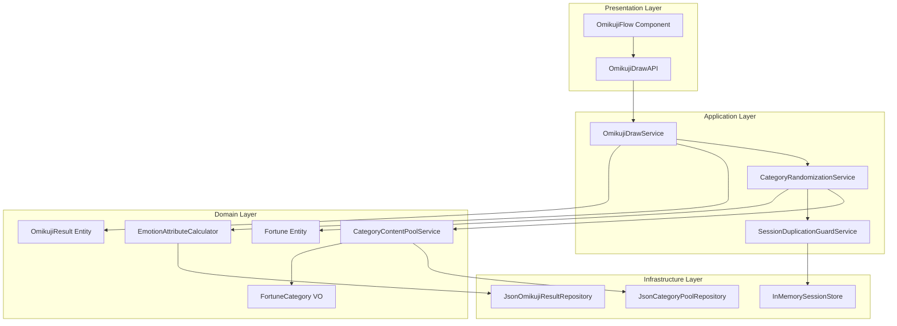
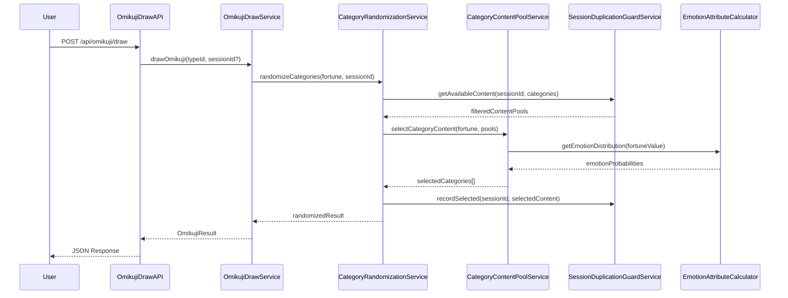
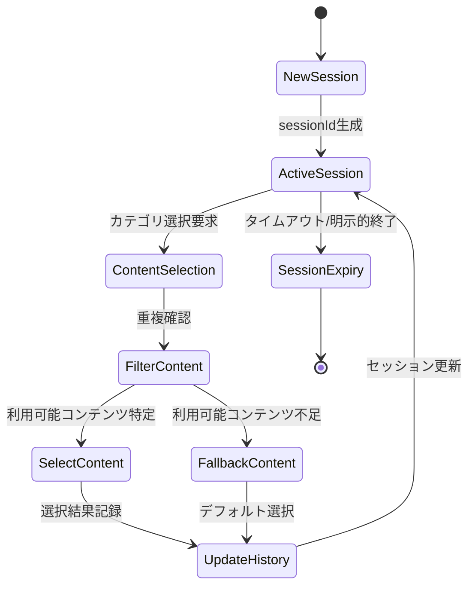
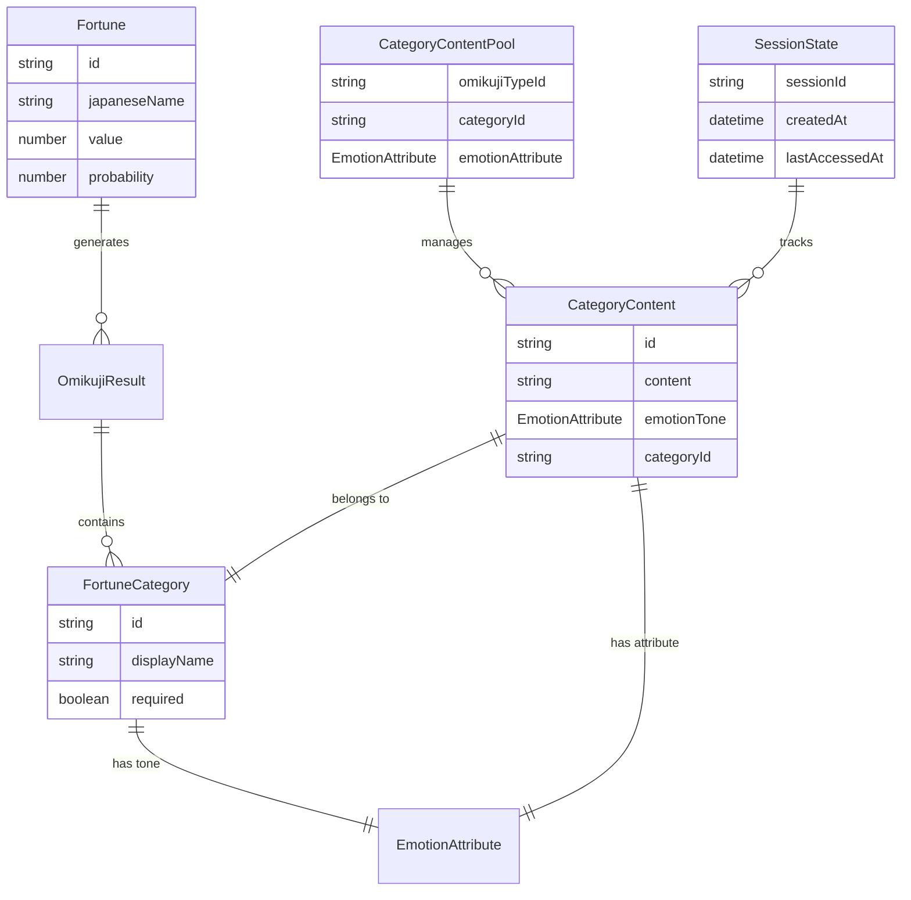
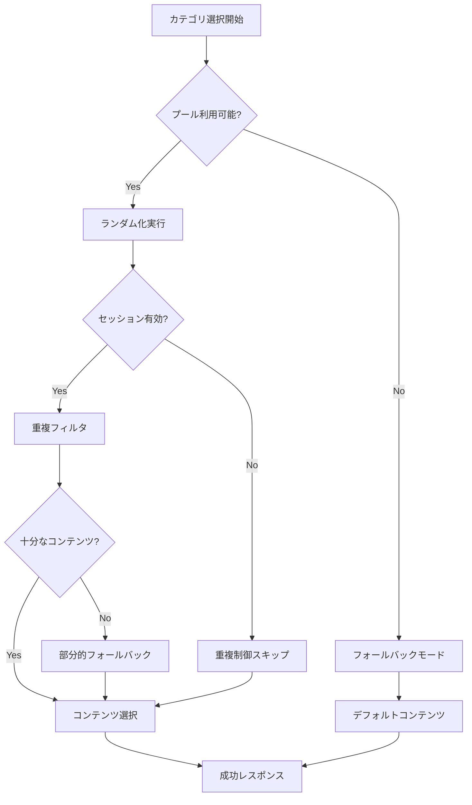
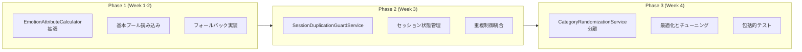

# Technical Design Document - 運勢ランダム化機能

## Overview

**目的**: この機能はエンジニア向けおみくじサービスにおいて、運勢カテゴリ（恋愛運、仕事運等）の動的ランダム化を実現し、予測不可能で飽きのこない体験を提供します。

**ユーザー**: エンジニアユーザーがおみくじを引く際に、従来の固定されたカテゴリセットではなく、メイン運勢に応じた確率分布に基づく動的なカテゴリ組み合わせを体験できます。

**影響**: 現在の固定カテゴリ結果システムを、感情属性別コンテンツプールと確率制御システムによるランダム化システムに変更します。

### Goals
- 各運勢カテゴリの独立したランダム選択による体験の多様化
- メイン運勢に応じた感情属性確率分布の適切な制御
- セッション内でのカテゴリコンテンツ重複回避による品質向上
- 既存クリーンアーキテクチャとの完全互換性維持

### Non-Goals
- おみくじタイプの増加や新規カテゴリの追加
- リアルタイム統計分析やユーザー行動追跡
- データベースシステムへの移行（JSON Repository継続使用）

## Architecture

### Existing Architecture Analysis

**現在のアーキテクチャパターン**: 
- ドメイン駆動設計（DDD）+ クリーンアーキテクチャを採用
- `OmikujiDrawService`による運勢確率選択
- `EmotionAttributeCalculator`による感情属性ベース結果選択
- `JsonOmikujiResultRepository`によるデータアクセス層

**既存ドメイン境界**:
- Domain層: `Fortune`, `OmikujiResult`, `FortuneCategory`エンティティ
- Application層: `OmikujiDrawService`によるユースケース実装
- Infrastructure層: JSONベースリポジトリパターン

**統合ポイント**:
- `IOmikujiResultRepository`インターフェースとの互換性保持
- 既存API Routes（`/api/omikuji/draw`）のレスポンス形式維持

### Architecture Pattern & Boundary Map



**アーキテクチャ統合**:
- **選択パターン**: ハイブリッドアプローチ（段階的拡張→専用サービス分離）
- **ドメイン境界**: カテゴリランダム化を新規境界として分離、感情計算は既存境界維持
- **既存パターン保持**: Repository Pattern、依存性注入、Result型による関数型エラーハンドリング
- **新コンポーネント根拠**: セッション管理とプール管理の明確な責務分離
- **ステアリング準拠**: TDD原則、型安全性、ドメイン中心設計の継続

### Technology Stack

| Layer | Choice / Version | Role in Feature | Notes |
|-------|------------------|-----------------|-------|
| Frontend | React 19.2.3 + TypeScript | おみくじUI統合、結果表示 | 既存OmikujiFlowコンポーネント拡張 |
| Backend | Next.js 16.1.1 API Routes | REST API提供、ランダム化処理 | `/api/omikuji/draw`エンドポイント拡張 |
| Data | JSON + seedrandom 3.0+ | コンテンツプール管理、決定論的乱数 | 新規依存: seedrandomライブラリ |
| Domain | TypeScript Strict Mode | 型安全なドメインロジック | Alias Methodによる加重選択最適化 |

## System Flows

### カテゴリランダム化フロー



**フローレベル決定事項**:
- セッション管理はオプショナル（sessionIdが提供されない場合は重複制御なし）
- 感情分布計算は既存ロジック活用でパフォーマンス最適化
- エラー時のフォールバック: デフォルトコンテンツによる graceful degradation

### セッション状態管理フロー



## Requirements Traceability

| Requirement | Summary | Components | Interfaces | Flows |
|-------------|---------|------------|------------|-------|
| 1.1, 1.2 | カテゴリ独立ランダム選択 | CategoryRandomizationService, CategoryContentPoolService | ICategoryRandomizationService, ICategoryContentPool | カテゴリランダム化フロー |
| 1.3 | 5カテゴリ必須維持 | FortuneCategory.getAllRequiredCategories() | CategoryContentPoolService.selectAllCategories() | カテゴリランダム化フロー |
| 2.1, 2.2 | 感情属性確率制御 | EmotionAttributeCalculator, EmotionAttributeDistribution | selectByEmotionAttribute(), forFortuneLevel() | カテゴリランダム化フロー |
| 2.3, 2.4, 2.5 | 運勢別確率分布 | EmotionAttributeDistribution.forFortuneLevel() | getEmotionDistribution() | カテゴリランダム化フロー |
| 3.1, 3.2 | コンテンツプール管理 | CategoryContentPoolService, JsonCategoryPoolRepository | ICategoryContentPool | カテゴリランダム化フロー |
| 3.3 | フォールバック機能 | CategoryContentPoolService.getDefaultContent() | provideFallbackContent() | セッション状態管理フロー |
| 3.4 | セッション内重複制御 | SessionDuplicationGuardService | ISessionDuplicationGuard | セッション状態管理フロー |
| 3.5 | おみくじタイプ別プール | JsonCategoryPoolRepository | findByTypeAndCategory() | カテゴリランダム化フロー |
| 4.1, 4.2, 4.3 | 既存アーキテクチャ互換 | OmikujiDrawService, IOmikujiResultRepository | drawOmikuji(), OmikujiResult | カテゴリランダム化フロー |
| 4.4, 4.5 | JSON拡張、API互換 | JsonCategoryPoolRepository, OmikujiDrawAPI | 拡張JSONスキーマ, API Response | カテゴリランダム化フロー |
| 5.1 | パフォーマンス100ms | CategoryRandomizationService（Alias Method） | O(1)加重選択 | カテゴリランダム化フロー |
| 5.2, 5.4 | 決定論的テスト | seedrandom統合, TestRandomSeedService | seedableRandom(), reproducibleTest() | テスト専用フロー |
| 5.3, 5.5 | 統計精度、整合性保証 | EmotionAttributeDistribution検証 | validateDistribution(), ensureConsistency() | 統計検証フロー |

## Components and Interfaces

### 概要

| Component | Domain/Layer | Intent | Req Coverage | Key Dependencies (P0/P1) | Contracts |
|-----------|--------------|--------|--------------|--------------------------|-----------|
| CategoryRandomizationService | Domain/Application | カテゴリランダム選択オーケストレーション | 1.1, 1.2, 1.3 | CategoryContentPoolService (P0), SessionGuard (P1) | Service |
| CategoryContentPoolService | Domain | 感情属性別コンテンツプール管理 | 3.1, 3.2, 3.3 | JsonCategoryPoolRepository (P0), EmotionAttributeCalculator (P0) | Service |
| SessionDuplicationGuardService | Domain | セッション内重複制御 | 3.4 | InMemorySessionStore (P0) | Service |
| JsonCategoryPoolRepository | Infrastructure | JSON形式プールデータアクセス | 3.5, 4.4 | ファイルシステム (P0) | Service |
| TestRandomSeedService | Infrastructure | 決定論的テスト用乱数制御 | 5.2, 5.4 | seedrandom (P0) | Service |

### Domain / Application Layer

#### CategoryRandomizationService

| Field | Detail |
|-------|--------|
| Intent | おみくじの各カテゴリをランダムに選択し、セッション管理と統合 |
| Requirements | 1.1, 1.2, 1.3, 2.1, 2.2, 2.3, 2.4, 2.5 |

**責務と制約**
- メイン運勢に基づく感情属性確率分布の適用
- 5つの必須カテゴリ（恋愛運、仕事運、健康運、金運、学業運）の完全性保証
- セッション重複制御との協調

**依存関係**
- Inbound: OmikujiDrawService — ランダム化要求処理 (P0)
- Outbound: CategoryContentPoolService — プール管理 (P0)
- Outbound: SessionDuplicationGuardService — 重複制御 (P1)
- External: seedrandom — 決定論的乱数生成 (P1)

**Contracts**: Service [✓]

##### Service Interface
```typescript
interface ICategoryRandomizationService {
  randomizeCategories(
    fortune: Fortune, 
    sessionId?: string,
    seed?: string
  ): Promise<Result<FortuneCategory[], RandomizationError>>;
  
  validateCategoryCompleteness(
    categories: FortuneCategory[]
  ): Result<boolean, ValidationError>;
}

type RandomizationError = 
  | { type: 'INSUFFICIENT_CONTENT_POOL'; category: string }
  | { type: 'SESSION_GUARD_FAILURE'; sessionId: string }
  | { type: 'EMOTION_DISTRIBUTION_ERROR'; fortuneValue: number };
```

**前提条件**:
- fortuneは有効なFortuneエンティティ
- sessionIdが提供される場合、セッションストアが利用可能

**事後条件**:
- 5つの必須カテゴリすべてが含まれた配列を返却
- 各カテゴリは運勢に応じた適切な感情属性を持つ

**不変条件**:
- 返却されるカテゴリ数は常に5
- セッション内で重複するコンテンツは選択されない

**実装ノート**
- **統合**: seedrandomによる決定論的ランダム化とAlias Methodによる最適化
- **検証**: 感情属性分布の統計的精度±5%以内の維持
- **リスク**: プール枯渇時のフォールバック動作、セッション状態の一貫性管理

#### CategoryContentPoolService

| Field | Detail |
|-------|--------|
| Intent | 感情属性別コンテンツプールの管理と選択 |
| Requirements | 3.1, 3.2, 3.3, 3.5 |

**責務と制約**
- カテゴリ×感情属性×おみくじタイプの3次元プール管理
- 動的コンテンツ統合とフォールバック機能
- 確率分布に基づく適切なコンテンツ選択

**依存関係**
- Inbound: CategoryRandomizationService — プール選択要求 (P0)
- Outbound: JsonCategoryPoolRepository — データアクセス (P0)
- Outbound: EmotionAttributeCalculator — 確率分布取得 (P0)

**Contracts**: Service [✓]

##### Service Interface
```typescript
interface ICategoryContentPoolService {
  selectCategoryContent(
    category: FortuneCategory,
    fortune: Fortune,
    omikujiTypeId: string,
    excludeContent?: string[]
  ): Promise<Result<CategoryContent, PoolError>>;
  
  getAvailableContentCount(
    category: FortuneCategory,
    emotionAttribute: EmotionAttribute,
    omikujiTypeId: string
  ): Promise<Result<number, PoolError>>;
  
  addContentToPool(
    content: CategoryContent,
    category: FortuneCategory,
    omikujiTypeId: string
  ): Promise<Result<void, PoolError>>;
}

interface CategoryContent {
  id: string;
  content: string;
  emotionTone: EmotionAttribute;
  category: FortuneCategory;
  metadata?: Record<string, unknown>;
}

type PoolError = 
  | { type: 'POOL_EXHAUSTED'; category: string; emotionAttribute: string }
  | { type: 'INVALID_CONTENT_FORMAT'; contentId: string }
  | { type: 'REPOSITORY_ACCESS_ERROR'; message: string };
```

**実装ノート**
- **統合**: 既存EmotionAttributeDistributionとの統合によるシームレスな確率制御
- **検証**: プール容量監視と適切なフォールバック選択
- **リスク**: JSON読み込み性能、メモリ効率的なプール管理

#### SessionDuplicationGuardService

| Field | Detail |
|-------|--------|
| Intent | セッション内でのコンテンツ重複制御 |
| Requirements | 3.4 |

**責務と制約**
- セッション状態の追跡と重複判定
- セッションタイムアウトとガベージコレクション
- スレッドセーフなセッション操作

**依存関係**
- Inbound: CategoryRandomizationService — 重複確認要求 (P0)
- Outbound: InMemorySessionStore — セッション永続化 (P0)

**Contracts**: Service [✓]

##### Service Interface
```typescript
interface ISessionDuplicationGuardService {
  filterAvailableContent(
    sessionId: string,
    availableContent: CategoryContent[]
  ): Promise<Result<CategoryContent[], SessionError>>;
  
  recordSelectedContent(
    sessionId: string,
    selectedContent: CategoryContent[]
  ): Promise<Result<void, SessionError>>;
  
  clearSession(sessionId: string): Promise<Result<void, SessionError>>;
}

type SessionError = 
  | { type: 'SESSION_NOT_FOUND'; sessionId: string }
  | { type: 'SESSION_STORAGE_ERROR'; message: string }
  | { type: 'CONCURRENT_MODIFICATION'; sessionId: string };
```

**実装ノート**
- **統合**: インメモリストレージによる高速アクセスとセッション自動期限切れ
- **検証**: 同時アクセス制御とデータ整合性保証
- **リスク**: メモリ使用量増加、セッション状態の永続化検討

### Infrastructure Layer

#### JsonCategoryPoolRepository

| Field | Detail |
|-------|--------|
| Intent | JSON形式でのカテゴリプールデータの読み書き |
| Requirements | 3.5, 4.4 |

**責務と制約**
- 拡張JSONスキーマによるプールデータ管理
- 既存データ形式との下位互換性維持
- ファイルシステムアクセスの最適化

**依存関係**
- Inbound: CategoryContentPoolService — データアクセス要求 (P0)
- External: Node.js fs/promises — ファイルシステムアクセス (P0)

**Contracts**: Service [✓]

##### Service Interface
```typescript
interface IJsonCategoryPoolRepository {
  findByTypeAndCategory(
    omikujiTypeId: string,
    category: FortuneCategory,
    emotionAttribute: EmotionAttribute
  ): Promise<Result<CategoryContent[], RepositoryError>>;
  
  findAllByType(
    omikujiTypeId: string
  ): Promise<Result<CategoryPoolData, RepositoryError>>;
  
  updatePool(
    omikujiTypeId: string,
    poolData: CategoryPoolData
  ): Promise<Result<void, RepositoryError>>;
}

interface CategoryPoolData {
  omikujiTypeId: string;
  pools: {
    [categoryId: string]: {
      [emotionAttribute in EmotionAttribute]: CategoryContent[];
    };
  };
  metadata: {
    lastUpdated: string;
    contentVersion: string;
    totalItems: number;
  };
}
```

**実装ノート**
- **統合**: 既存JsonOmikujiResultRepositoryパターンの拡張による一貫性確保
- **検証**: JSONスキーマバリデーションと段階的データ移行
- **リスク**: ファイルサイズ増大、読み込み性能への影響

## Data Models

### Domain Model



**集約とトランザクション境界**:
- **カテゴリ選択集約**: CategoryRandomizationService配下でのアトミックな5カテゴリ選択
- **セッション状態集約**: SessionDuplicationGuardService配下での整合性保証

**ビジネスルールと不変条件**:
- 運勢結果は必ず5つの必須カテゴリを含む
- セッション内で同一コンテンツは重複選択されない
- 感情属性確率分布の合計は1.0（許容誤差±0.0001）

### Logical Data Model

**構造定義**:
```typescript
// 拡張JSONスキーマ構造
interface ExtendedOmikujiResultData {
  omikujiTypeId: string;
  
  // 既存の固定結果（下位互換性維持）
  results?: {
    [fortuneId: string]: Array<{
      id: string;
      titlePhrase: string;
      description: string;
      emotionAttribute: EmotionAttribute;
      categories: Array<{
        name: CategoryName;
        content: string;
        emotionTone: EmotionAttribute;
      }>;
    }>;
  };
  
  // 新規プール構造
  categoryPools?: {
    [categoryId: string]: {
      [emotionAttribute in EmotionAttribute]: Array<{
        id: string;
        content: string;
        weight?: number; // オプショナル重み
        metadata?: Record<string, unknown>;
      }>;
    };
  };
  
  metadata: {
    lastUpdated: string;
    contentVersion: string;
    poolEnabled: boolean; // プール機能有効フラグ
  };
}
```

**一貫性と整合性**:
- プール有効時は categoryPools を優先、フォールバック時は results を使用
- セッション状態は10分間の自動期限切れ
- カテゴリプールの重み正規化は実行時に動的実施

**時間的側面**:
- セッション状態: 作成時刻とアクセス時刻による期限管理
- コンテンツプール: lastUpdatedによるキャッシュ無効化判定

### Data Contracts & Integration

**API Data Transfer**:
```typescript
// 既存API Response（変更なし）
interface OmikujiDrawResponse {
  success: boolean;
  data?: {
    id: string;
    fortune: string;
    titlePhrase: string;
    description: string;
    categories: Array<{
      name: CategoryName;
      content: string;
    }>;
    shareText: string;
  };
  error?: string;
}

// 新規内部サービス間通信
interface CategorySelectionRequest {
  fortune: Fortune;
  omikujiTypeId: string;
  sessionId?: string;
  seed?: string; // テスト用
}
```

## Error Handling

### Error Strategy

**エラーカテゴリと対応戦略**:

**User Errors (4xx)**: 
- Invalid sessionId → 新規セッション自動作成
- Unsupported omikujiType → サポート済みタイプ一覧提示

**System Errors (5xx)**: 
- Pool data access failure → デフォルトコンテンツによるフォールバック
- Memory shortage in session store → 最古セッションの自動削除

**Business Logic Errors (422)**:
- Insufficient pool content → フォールバック機能による graceful degradation
- Session state corruption → セッション再初期化と警告ログ

### エラーフロー



### Monitoring

- **エラー率監視**: プール枯渇頻度とフォールバック実行回数
- **パフォーマンス監視**: カテゴリ選択処理時間（100ms要件）
- **セッション監視**: アクティブセッション数とメモリ使用量

## Testing Strategy

### Unit Tests
- `CategoryRandomizationService.randomizeCategories()` - 確率分布準拠テスト
- `EmotionAttributeDistribution.selectEmotionAttribute()` - 統計精度検証
- `SessionDuplicationGuardService.filterAvailableContent()` - 重複制御ロジック
- `JsonCategoryPoolRepository.findByTypeAndCategory()` - データアクセス層

### Integration Tests  
- おみくじ抽選フローエンドツーエンド（API → Service → Repository）
- セッション状態管理とカテゴリ選択の協調動作
- JSON プール拡張とフォールバック機能の統合
- 決定論的テスト環境でのシード再現性確認

### Performance Tests
- 100ms以内のカテゴリ選択処理時間検証
- 1000並行セッションでの性能劣化測定
- プールサイズ増大時のメモリ使用量とレスポンス時間
- セッション数増加時のガベージコレクション影響評価

### E2E Tests
- ブラウザ環境でのおみくじランダム化体験
- 連続おみくじ実行での重複回避動作確認
- 異なる運勢での感情属性分布の視覚的検証

## Performance & Scalability

**目標メトリック**:
- カテゴリ選択処理: 100ms以内（95パーセンタイル）
- セッション状態アクセス: 10ms以内
- JSON プールデータ読み込み: 50ms以内

**スケーリングアプローチ**:
- **水平スケーリング**: ステートレス設計により複数インスタンス対応
- **セッション分散**: セッションIDによるコンシステントハッシュ分散

**キャッシュ戦略**:
- プールデータのインメモリキャッシュ（ファイル更新時無効化）
- 感情分布計算結果のメモ化（Fortune値ベース）

## Migration Strategy

### 段階的展開フロー



**ロールバック戦略**:
- フィーチャーフラグによる即座の旧システム復帰
- JSON データ構造の下位互換性による無停止切り戻し
- セッション状態の適切なクリアとガベージコレクション