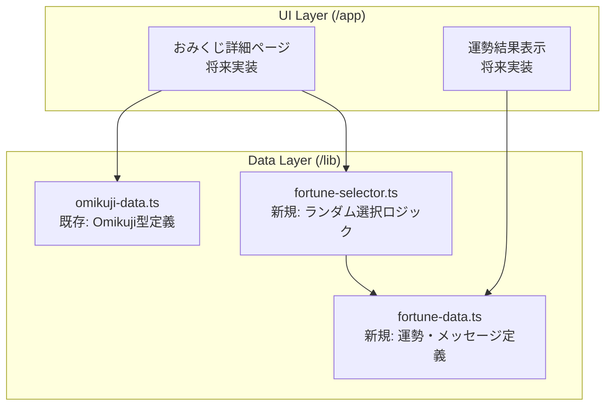
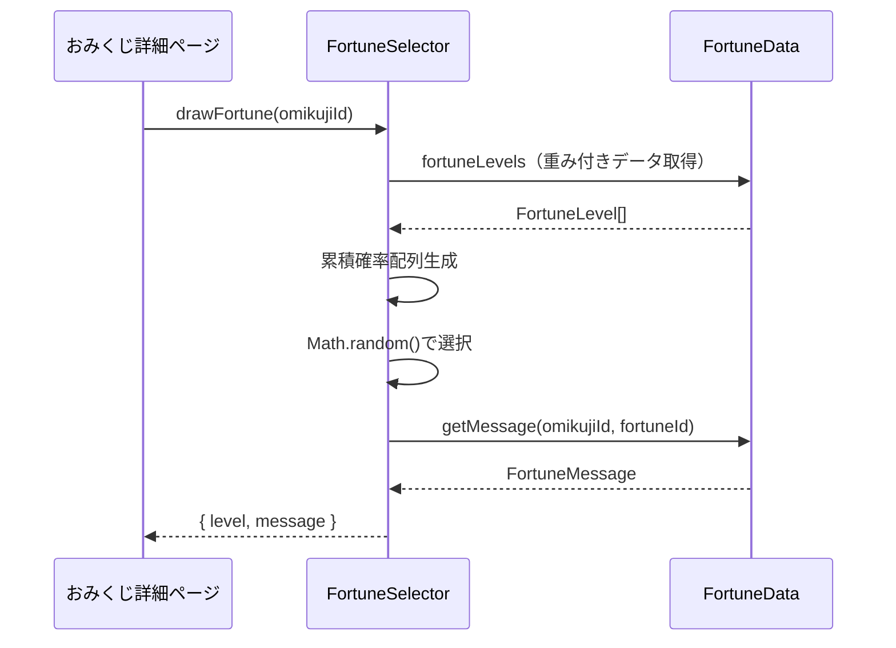
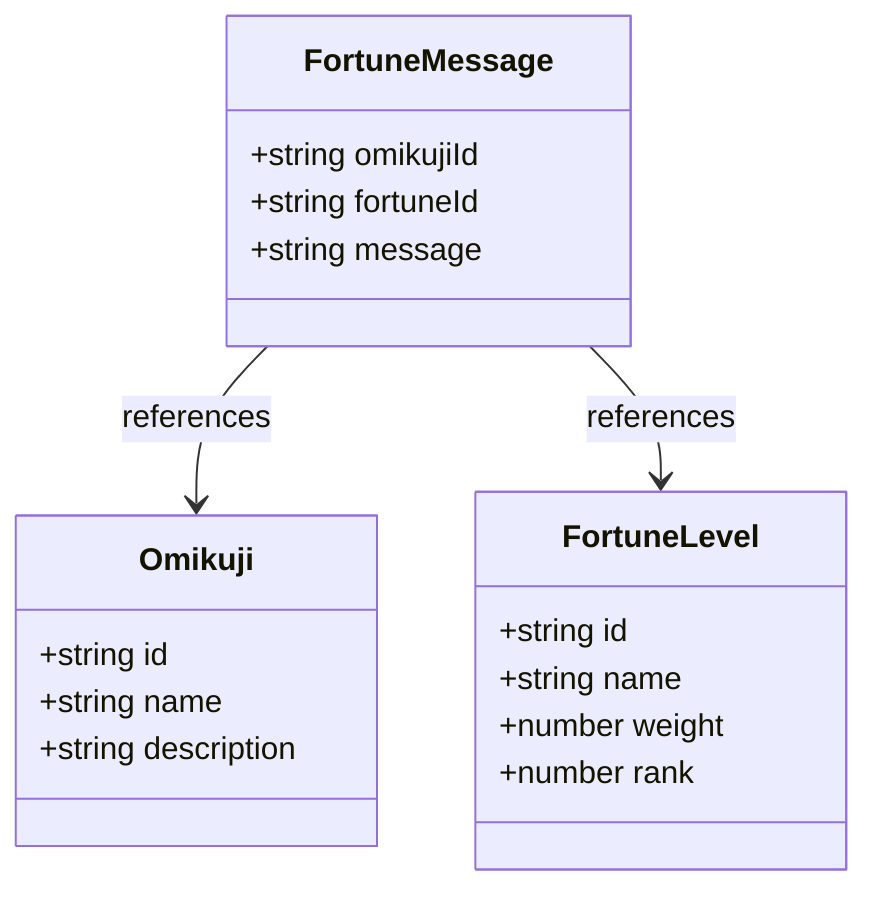

# Design Document: 運勢種類システム

## Overview
本機能は、エンジニア向けおみくじアプリケーションに7段階の運勢種類（大吉、吉、中吉、小吉、末吉、凶、大凶）を導入し、各おみくじタイプと運勢レベルの組み合わせに対応したメッセージシステムを提供する。既存の`Omikuji`型定義と統合し、重み付き確率分布を使用してポジティブな体験（大吉・吉・中吉が多く出る）を実現する。

**Purpose**: ユーザーがおみくじを引いた際に、運勢レベルとエンジニア特化のメッセージを受け取ることで、楽しく業務に関連した体験を提供する。

**Users**: エンジニアおみくじアプリの全ユーザーが、おみくじを引く際にこのシステムを利用する。

**Impact**: 既存のおみくじデータ構造を拡張し、運勢結果の表示とメッセージ配信の機能を追加する。既存の`lib/omikuji-data.ts`との統合が必要。

### Goals
- 7段階の運勢レベルを型安全に定義し、アプリケーション全体で一貫して使用可能にする
- 各おみくじタイプ×運勢レベルの組み合わせ（4×7=28パターン）に対応したエンジニア向けメッセージを提供する
- 重み付き確率分布により、大吉・吉・中吉が高確率で出るランダム選択を実装する
- 既存の`Omikuji`型定義と統合可能な設計とする
- TypeScript strict modeで型安全性を保証し、将来の拡張性を確保する

### Non-Goals
- おみくじ詳細ページのUI実装（別specで対応）
- 運勢結果の永続化やユーザー履歴管理（認証不要のため範囲外）
- 複数パターンのメッセージランダム表示（初期バージョンでは1対1対応）
- 運勢確率のA/Bテストや動的調整機能（将来検討）

## Architecture

### Existing Architecture Analysis
既存システムは以下のパターンを採用している：
- **データ定義**: `lib/omikuji-data.ts`にTypeScriptインターフェースとreadonly配列を配置
- **型安全性**: TypeScript strict modeで厳格な型チェック
- **イミュータビリティ**: `as const`を使用したイミュータブルなデータ構造
- **パスエイリアス**: `@/*`を使用したクリーンなインポート

本機能はこれらのパターンを踏襲し、既存の`Omikuji`型と並行して使用可能な設計とする。

### Architecture Pattern & Boundary Map



**Architecture Integration**:
- **Selected pattern**: Data-driven design with pure functions - 静的データと純粋関数による宣言的設計
- **Domain/feature boundaries**: データ定義（fortune-data.ts）とロジック（fortune-selector.ts）を分離し、単一責任原則を適用
- **Existing patterns preserved**: 既存の`omikuji-data.ts`パターン（interface + readonly array）を踏襲
- **New components rationale**:
  - `fortune-data.ts`: 運勢とメッセージのマスターデータを管理
  - `fortune-selector.ts`: 重み付き確率選択ロジックを提供
- **Steering compliance**: TypeScript strict mode、/lib/ディレクトリ配置、イミュータブルデータ管理の原則を維持

### Technology Stack

| Layer | Choice / Version | Role in Feature | Notes |
|-------|------------------|-----------------|-------|
| Language | TypeScript (strict mode) | 運勢型定義、ランダム選択ロジック | 既存プロジェクトの標準、型安全性を厳格に適用 |
| Runtime | Node.js 24.12.0 | 開発・ビルド環境 | 既存の設定を継承 |
| Framework | Next.js 16.1.1 (App Router) | UIレイヤー統合（将来のおみくじ詳細ページ） | 既存のフレームワーク、本機能ではデータ層のみ実装 |
| Data Structure | Readonly arrays (`as const`) | イミュータブルなマスターデータ | 既存パターンを踏襲、型推論を最大化 |

## System Flows

### 運勢ランダム選択フロー



**Key Decisions**:
- 累積確率配列は初回呼び出し時に生成し、メモ化することでパフォーマンスを最適化
- ランダム選択は純粋関数として実装し、テスト可能性を確保
- メッセージ取得は線形探索（O(n)）だが、データ量が28件と少ないため問題なし

## Requirements Traceability

| Requirement | Summary | Components | Interfaces | Flows |
|-------------|---------|------------|------------|-------|
| 1.1, 1.2, 1.3, 1.4, 1.5 | 運勢タイプの定義（7段階、型安全） | FortuneData | FortuneLevel型 | - |
| 2.1, 2.2, 2.3, 2.4, 2.5 | 運勢メッセージの定義（おみくじ×運勢の組み合わせ） | FortuneData | FortuneMessage型、fortuneMessages配列 | - |
| 3.1, 3.2, 3.3, 3.4 | データ構造（型定義、イミュータブル） | FortuneData | FortuneLevel型、FortuneMessage型 | - |
| 4.1, 4.2, 4.3, 4.4 | 運勢の表示（UI） | （将来のUI実装） | - | - |
| 5.1, 5.2, 5.3, 5.4, 5.5, 5.6, 5.7 | ランダム運勢選択と確率分布 | FortuneSelector | drawFortune関数 | 運勢ランダム選択フロー |
| 6.1, 6.2, 6.3, 6.4, 6.5 | 技術的制約（TypeScript、/lib/配置） | FortuneData, FortuneSelector | 全インターフェース | - |
| 7.1, 7.2, 7.3, 7.4 | パフォーマンス・アクセシビリティ | FortuneData, FortuneSelector | 静的データ、純粋関数 | - |

## Components and Interfaces

### Component Summary

| Component | Domain/Layer | Intent | Req Coverage | Key Dependencies (P0/P1) | Contracts |
|-----------|--------------|--------|--------------|--------------------------|-----------|
| FortuneData | Data/Lib | 運勢レベルとメッセージのマスターデータ管理 | 1.1-1.5, 2.1-2.5, 3.1-3.4, 6.1-6.5, 7.1-7.4 | なし | State |
| FortuneSelector | Logic/Lib | 重み付き確率分布によるランダム運勢選択 | 5.1-5.7, 6.1-6.5, 7.1-7.4 | FortuneData (P0) | Service |

### Data Layer

#### FortuneData

| Field | Detail |
|-------|--------|
| Intent | 運勢レベル（7段階）とメッセージ（28パターン）のマスターデータを型安全に提供する |
| Requirements | 1.1, 1.2, 1.3, 1.4, 1.5, 2.1, 2.2, 2.3, 2.4, 2.5, 3.1, 3.2, 3.3, 3.4, 6.1, 6.2, 6.3, 6.4, 6.5, 7.1 |

**Responsibilities & Constraints**
- 7段階の運勢レベル定義（大吉、吉、中吉、小吉、末吉、凶、大凶）を型安全に提供
- 各運勢レベルにID、表示名、重み（確率）、ランク（順序）を持たせる
- 4種類のおみくじ×7段階の運勢=28パターンのメッセージを提供
- イミュータブルなreadonly配列として管理し、ランタイムでの変更を防止
- TypeScript strict modeで型推論を最大化

**Dependencies**
- Inbound: FortuneSelector, UI components（将来） - データ参照 (P0)
- Outbound: なし
- External: なし

**Contracts**: State [✓]

##### State Management

**State model**:
```typescript
/**
 * 運勢レベルを表すインターフェース
 */
interface FortuneLevel {
  id: string;           // 一意識別子（例: 'daikichi', 'kichi'）
  name: string;         // 表示名（例: '大吉', '吉'）
  weight: number;       // 確率の重み（例: 20, 25）
  rank: number;         // 順序（1=最高、7=最低）
}

/**
 * 運勢メッセージを表すインターフェース
 */
interface FortuneMessage {
  omikujiId: string;    // おみくじID（例: 'daily-luck'）
  fortuneId: string;    // 運勢ID（例: 'daikichi'）
  message: string;      // メッセージ本文（100文字程度）
}

/**
 * 運勢レベルのマスターデータ（7種類）
 */
const fortuneLevels: readonly FortuneLevel[] = [
  { id: 'daikichi', name: '大吉', weight: 20, rank: 1 },
  { id: 'kichi', name: '吉', weight: 25, rank: 2 },
  { id: 'chukichi', name: '中吉', weight: 25, rank: 3 },
  { id: 'shokichi', name: '小吉', weight: 15, rank: 4 },
  { id: 'suekichi', name: '末吉', weight: 10, rank: 5 },
  { id: 'kyo', name: '凶', weight: 4, rank: 6 },
  { id: 'daikyo', name: '大凶', weight: 1, rank: 7 },
] as const;

/**
 * 運勢メッセージのマスターデータ（28パターン）
 */
const fortuneMessages: readonly FortuneMessage[] = [
  // daily-luck × 7運勢
  { omikujiId: 'daily-luck', fortuneId: 'daikichi', message: '今日は最高の1日！コードもレビューもスムーズに進みます。' },
  { omikujiId: 'daily-luck', fortuneId: 'kichi', message: '良い1日になりそうです。積極的にチャレンジしましょう。' },
  // ... 残り26パターン
] as const;
```

**Persistence & consistency**:
- 静的データとしてコンパイル時に確定、ランタイムでの変更なし
- `as const`によりイミュータブル性を保証
- TypeScriptの型推論により、全28パターンの存在をコンパイル時にチェック可能

**Concurrency strategy**:
- 読み取り専用データのため、並行アクセスの問題なし

**Implementation Notes**
- **Integration**: 既存の`@/lib/omikuji-data`と同階層に`@/lib/fortune-data`として配置。両者は独立したモジュールとして相互インポート可能
- **Validation**: TypeScriptの型システムにより、全28パターンのメッセージが存在することをコンパイル時に検証。重みの合計が100になることもユニットテストで確認
- **Risks**: メッセージ数が多い（28件）ため、手動管理でのミスが懸念される。型定義とテストで網羅性を保証

### Logic Layer

#### FortuneSelector

| Field | Detail |
|-------|--------|
| Intent | 重み付き確率分布を使用して運勢レベルをランダムに選択し、対応するメッセージを返す |
| Requirements | 5.1, 5.2, 5.3, 5.4, 5.5, 5.6, 5.7, 6.1, 6.2, 6.3, 6.4, 6.5, 7.1 |

**Responsibilities & Constraints**
- 運勢レベルの重み（weight）に基づいた累積確率分布を生成
- JavaScriptの`Math.random()`を使用してランダムに運勢を選択
- 選択された運勢とおみくじIDに対応するメッセージを取得
- 純粋関数として実装し、副作用なし、テスト可能性を確保
- 確率の重み付けは`FortuneData`の定義に依存し、調整可能な設計

**Dependencies**
- Inbound: UI components（将来） - 運勢抽選リクエスト (P0)
- Outbound: FortuneData - 運勢データとメッセージデータの参照 (P0)
- External: JavaScript標準ライブラリ（Math.random） - 乱数生成 (P0)

**Contracts**: Service [✓]

##### Service Interface

```typescript
/**
 * 運勢抽選結果を表すインターフェース
 */
interface FortuneResult {
  level: FortuneLevel;      // 選ばれた運勢レベル
  message: string;          // 対応するメッセージ
}

/**
 * 運勢選択サービスのインターフェース
 */
interface FortuneSelectorService {
  /**
   * 指定されたおみくじIDに対して運勢をランダムに選択する
   *
   * @param omikujiId - おみくじの一意識別子
   * @returns 運勢レベルとメッセージを含む結果オブジェクト
   * @throws Error おみくじIDが不正な場合、またはメッセージが見つからない場合
   */
  drawFortune(omikujiId: string): FortuneResult;
}

/**
 * 重み付き確率分布を使用した運勢選択関数
 *
 * @param omikujiId - おみくじの一意識別子
 * @returns 運勢抽選結果
 */
function drawFortune(omikujiId: string): FortuneResult;

/**
 * ヘルパー関数: メッセージ取得
 *
 * @param omikujiId - おみくじID
 * @param fortuneId - 運勢ID
 * @returns メッセージ文字列
 * @throws Error メッセージが見つからない場合
 */
function getFortuneMessage(omikujiId: string, fortuneId: string): string;
```

**Preconditions**:
- `omikujiId`は有効なおみくじID（`'daily-luck'`, `'code-review'`, `'bug-encounter'`, `'deploy-luck'`のいずれか）でなければならない
- `FortuneData`の`fortuneLevels`と`fortuneMessages`が正しく定義されていること

**Postconditions**:
- 返される`FortuneResult`は有効な運勢レベルとメッセージを含む
- 選択された運勢の確率分布は、`fortuneLevels`の`weight`に従う
- 関数呼び出しは副作用を持たない（純粋関数）

**Invariants**:
- 運勢の確率分布は呼び出しごとに一貫している（重みが固定）
- 同じ入力に対して異なる出力を返す（ランダム性）が、確率分布は一定

**Implementation Notes**
- **Integration**: UIコンポーネント（おみくじ詳細ページ）から呼び出される。`@/lib/fortune-selector`としてエクスポート
- **Validation**:
  - `omikujiId`の妥当性チェック（既存の`omikujiList`に存在するか確認）
  - メッセージが見つからない場合はエラーをスロー
  - 重みの合計が0以下の場合はエラーをスロー
- **Risks**:
  - `Math.random()`の品質に依存（暗号学的に安全ではないが、おみくじ用途では十分）
  - 確率分布のテストには大量サンプリング（10,000回以上）が必要

## Data Models

### Domain Model

**Entities**:
- **FortuneLevel**: 運勢レベルを表す値オブジェクト。ID、表示名、重み、ランクを持つ。
- **FortuneMessage**: 運勢メッセージを表す値オブジェクト。おみくじID、運勢ID、メッセージ本文を持つ。

**Aggregates**:
- 運勢システムは単一の集約として扱われる。運勢レベルとメッセージは常に一緒に管理され、トランザクション境界は存在しない（静的データのため）。

**Business Rules & Invariants**:
- 運勢レベルは7種類で固定（大吉、吉、中吉、小吉、末吉、凶、大凶）
- 各運勢レベルの重みの合計は100（％）
- 各おみくじIDと運勢IDの組み合わせに対して、メッセージが1つ存在する（全28パターン）
- ランク1が最高、ランク7が最低



### Logical Data Model

**Structure Definition**:
- **FortuneLevel**:
  - `id` (string, primary key): 運勢レベルの一意識別子
  - `name` (string): 日本語表示名
  - `weight` (number): 確率の重み（1-100の整数）
  - `rank` (number): 順序（1-7の整数）
- **FortuneMessage**:
  - `omikujiId` (string, foreign key): おみくじIDを参照
  - `fortuneId` (string, foreign key): 運勢IDを参照
  - `message` (string): メッセージ本文（100文字程度）

**Consistency & Integrity**:
- 全てのデータは静的でイミュータブル、実行時の整合性チェックは不要
- TypeScriptの型システムにより、コンパイル時にデータの存在と型を保証
- ユニットテストで全28パターンのメッセージの存在を検証

**Transaction Boundaries**:
- トランザクションは存在しない（静的データ、永続化なし）

**Temporal Aspects**:
- バージョニングなし（コードデプロイによりデータ更新）
- 監査ログなし（認証不要のため）

### Data Contracts & Integration

**API Data Transfer**:
```typescript
// 運勢抽選結果のレスポンス型
interface FortuneResult {
  level: {
    id: string;
    name: string;
    weight: number;
    rank: number;
  };
  message: string;
}
```

**Serialization Format**: JSON（将来のAPI化を考慮）

**Schema Versioning**: 現時点では不要（静的データ）。将来的にメッセージフィールドを追加する場合は、オプショナルフィールドとして拡張可能な設計とする。

## Error Handling

### Error Strategy
データ層とロジック層の両方で明示的なエラーハンドリングを実装し、不正な入力や欠損データに対して明確なエラーメッセージを返す。

### Error Categories and Responses

**User Errors (4xx相当)**:
- **Invalid omikujiId**: 存在しないおみくじIDが指定された場合
  - Error: `Error: Invalid omikuji ID: ${omikujiId}`
  - Recovery: 有効なおみくじIDのリストを提供、UIで選択肢を制限
- **Invalid fortuneId**: 存在しない運勢IDが指定された場合
  - Error: `Error: Invalid fortune ID: ${fortuneId}`
  - Recovery: 内部エラーとして扱い、開発時にのみ発生

**System Errors (5xx相当)**:
- **Message Not Found**: おみくじIDと運勢IDの組み合わせに対応するメッセージが見つからない場合
  - Error: `Error: Fortune message not found for omikujiId=${omikujiId}, fortuneId=${fortuneId}`
  - Recovery: フォールバックメッセージを返す、または開発時にエラーを検出
- **Weight Sum Invalid**: 運勢レベルの重みの合計が不正な場合
  - Error: `Error: Total weight must be greater than 0`
  - Recovery: 開発時にエラーを検出、ユニットテストで防止

**Business Logic Errors (422相当)**:
- 本機能には複雑なビジネスロジックエラーは存在しない

### Monitoring
- エラーはコンソールログに出力
- 将来的にエラートラッキングサービス（Sentry等）を導入する場合は、運勢選択の失敗率を監視

## Testing Strategy

### Unit Tests
- **FortuneData**:
  1. `fortuneLevels`配列が7要素を持つことを検証
  2. 各`FortuneLevel`が必須フィールド（id, name, weight, rank）を持つことを検証
  3. 重みの合計が100であることを検証
  4. ランクが1から7まで重複なく存在することを検証
  5. `fortuneMessages`配列が28要素（4おみくじ×7運勢）を持つことを検証
- **FortuneSelector**:
  1. `drawFortune`関数が有効なおみくじIDに対して`FortuneResult`を返すことを検証
  2. 不正なおみくじIDに対してエラーをスローすることを検証
  3. `getFortuneMessage`関数が正しいメッセージを返すことを検証
  4. 存在しない組み合わせに対してエラーをスローすることを検証
  5. 確率分布のテスト：10,000回の抽選で各運勢の出現率が重みに近いことを統計的に検証（許容誤差±5%）

### Integration Tests
- **既存`Omikuji`型との統合**:
  1. `omikujiList`の各IDに対して運勢抽選が成功することを検証
  2. 全28パターンのメッセージが取得可能であることを検証
  3. 不正なおみくじIDに対して適切にエラーハンドリングされることを検証

### E2E/UI Tests
（本機能ではデータ層のみのため、UI実装後に追加）

### Performance Tests
1. `drawFortune`関数の実行時間が1ms以下であることを検証
2. 1,000回連続呼び出しでメモリリークがないことを検証

## Optional Sections

### Performance & Scalability
**Target Metrics**:
- 運勢選択処理: < 1ms（累積確率配列の生成とランダム選択）
- メッセージ取得処理: < 0.5ms（28件の線形探索）

**Optimization Techniques**:
- 累積確率配列は初回生成後にメモ化（クロージャまたはモジュールスコープ変数）
- データは静的配列として事前定義され、ランタイムでの計算コストなし
- 将来的にメッセージ数が増加した場合、MapまたはオブジェクトによるO(1)検索に変更

**Scalability**:
- 現在のデータ量（7運勢×4おみくじ=28パターン）では、スケーラビリティの懸念なし
- 将来的におみくじ種類が増えても、線形的なデータ増加のみ（O(n)）
