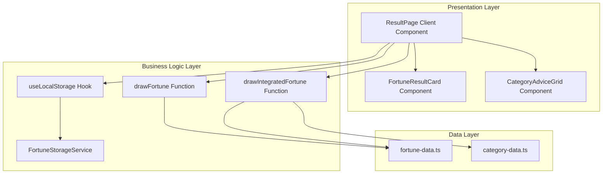
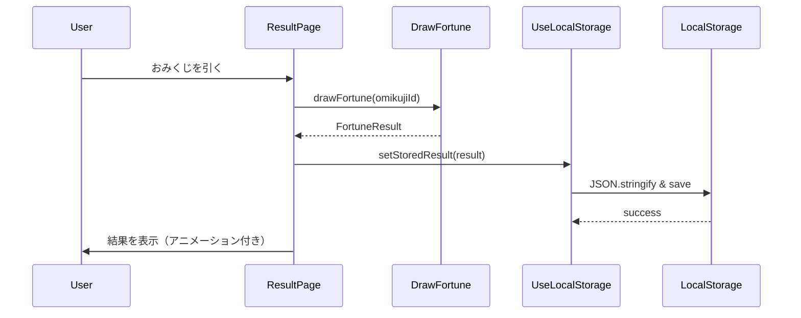
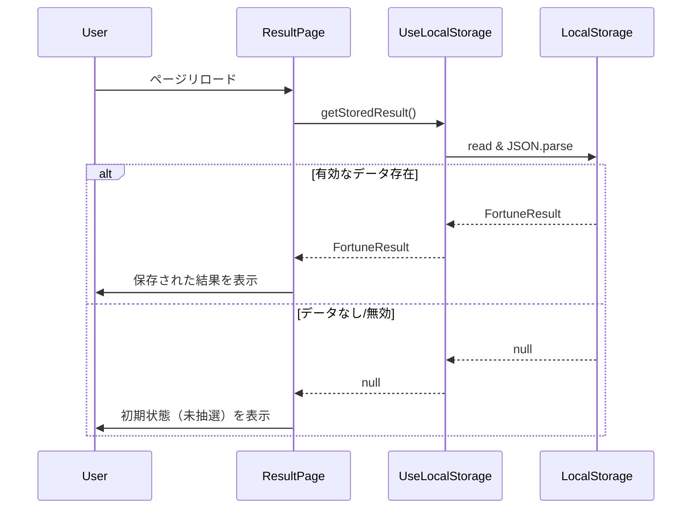
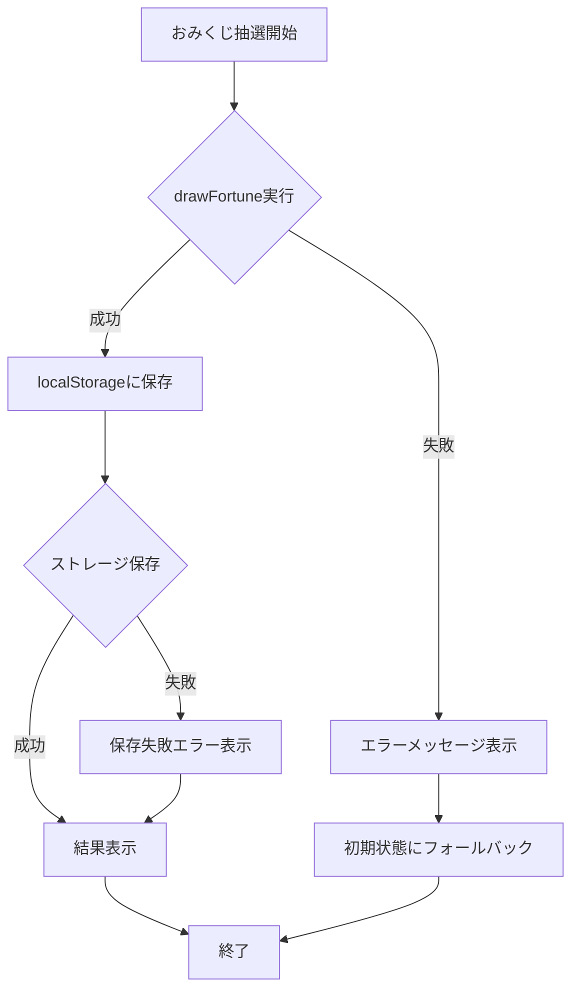
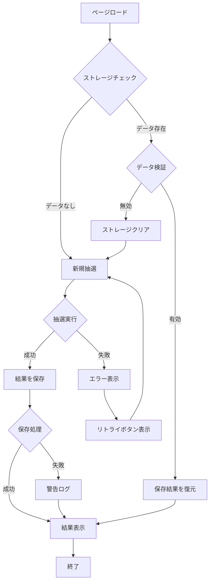

# Design Document

## Overview
本設計は、エンジニア向けおみくじアプリケーションにおける運勢結果の表示・管理機能を実現する。ユーザーがおみくじを引いた後、運勢レベル、メッセージ、カテゴリ別アドバイス（統合運勢の場合）を視覚的にわかりやすく表示し、ブラウザストレージを使用した結果の永続化、リセット機能、共有機能（将来展開）を提供する。既存の運勢抽選システム（`drawFortune`, `drawIntegratedFortune`）と統合し、Next.js App RouterとReact 19のベストプラクティスに従ったClient Component設計を採用する。

**Purpose**: ユーザーに楽しいおみくじ体験を提供し、結果を保存・再表示することで利便性を向上させる。

**Users**: ソフトウェアエンジニア（ログイン不要の一般公開型Webサービス利用者）がおみくじを引いた後、結果を確認・共有するワークフローで使用する。

**Impact**: 既存のトップページ（`/app/page.tsx`）とおみくじ詳細ページ（`/app/omikuji/[id]/page.tsx`、新規作成）に結果表示機能を追加し、`/lib/`配下にストレージ管理ロジックを追加する。

### Goals
- 7段階の運勢レベル（大吉〜大凶）を視覚的に区別し、直感的な結果表示を実現
- 統合運勢の6カテゴリアドバイスを見やすいレイアウトで提供
- ブラウザストレージ（localStorage）を使用した型安全な結果の永続化
- リセット機能による再抽選のスムーズな実装
- アクセシビリティ（WCAG 2.1 AA準拠）とパフォーマンス（100ms以内のレンダリング）の両立

### Non-Goals
- ユーザー認証機能（認証不要の公開型サービス）
- 運勢履歴の長期保存（最新結果のみ保存）
- サーバーサイドでの結果保存（クライアントサイドのみ）
- 統合運勢以外の新しいおみくじタイプの追加（既存システムを利用）

## Architecture

### Existing Architecture Analysis
既存システムでは、運勢抽選ロジックが`/lib/`配下に純粋関数として実装されており、以下の構成となっている：

- **運勢データ層**: `fortune-data.ts`（`FortuneLevel`, `FortuneMessage`型定義とマスターデータ）
- **抽選ロジック層**: `fortune-selector.ts`（重み付き確率分布によるランダム選択）
- **メッセージ取得層**: `fortune-message-getter.ts`（おみくじID × 運勢レベルでメッセージ取得）
- **統合層**: `draw-fortune.ts`（基本運勢）、`integrated-fortune.ts`（統合運勢）
- **UI層**: `app/page.tsx`（トップページ）、`app/components/OmikujiCard.tsx`（カード型UI）

現在、おみくじ選択後の結果表示機能は未実装であり、本設計で追加する。既存の型定義とロジックを最大限再利用し、新規コンポーネントとカスタムフックを追加することで統合する。

### Architecture Pattern & Boundary Map

**Selected Pattern**: **Layered Architecture** with **Client Component + Custom Hook**

**Domain Boundaries**:
- **Presentation Layer** (`/app/omikuji/[id]/`): 結果表示UI（Client Component）
- **Business Logic Layer** (`/lib/`): ストレージ管理カスタムフック、型定義
- **Data Layer** (`/lib/fortune-data.ts`): 既存の運勢マスターデータ（変更なし）

**Architecture Integration**:
- 既存の純粋関数アーキテクチャ（`drawFortune`, `drawIntegratedFortune`）を維持
- Client Componentでブラウザストレージにアクセスし、カスタムフックで抽象化
- 型安全性を保証するためTypeScript Genericsを活用
- Next.js App Routerの規約に従いファイルを配置（`/app/omikuji/[id]/page.tsx`）



**Key Decisions**:
- Client Componentでのブラウザストレージアクセス（SSR非対応APIのためuseEffect内で実行）
- カスタムフック（`useLocalStorage`）による型安全なストレージ抽象化
- 既存の`FortuneResult`と`IntegratedFortuneResult`型をそのまま活用

**Existing Patterns Preserved**:
- 純粋関数によるロジック実装（副作用なし、テスタビリティ高）
- TypeScript strict mode（`any`型禁止、明示的型定義）
- Tailwind CSS 4によるユーティリティファーストスタイリング
- TDDによる実装（`/lib/__tests__/`配下にテスト配置）

**New Components Rationale**:
- `useLocalStorage`: 型安全なストレージアクセスの抽象化、SSR対応、エラーハンドリング
- `FortuneResultCard`: 運勢結果のビジュアル表示、レスポンシブデザイン、アクセシビリティ
- `CategoryAdviceGrid`: 6カテゴリアドバイスのグリッドレイアウト
- `/app/omikuji/[id]/page.tsx`: 結果表示ページ（動的ルーティング）

**Steering Compliance**:
- `structure.md`: `/lib/`にロジック配置、`/app/`にUI配置、コロケーション原則
- `tech.md`: TypeScript strict、Next.js App Router、React 19、Tailwind CSS 4
- `product.md`: 認証不要、シンプルなUI、エンジニア向けメッセージ

### Technology Stack

| Layer | Choice / Version | Role in Feature | Notes |
|-------|------------------|-----------------|-------|
| Frontend | React 19.2.3 | Client Component実装、useEffect/useStateによる状態管理 | Server Components firstだが、ストレージアクセスのためClient Component必須 |
| Framework | Next.js 16.1.1 (App Router) | 動的ルーティング（`/omikuji/[id]/page.tsx`）、SSRとCSRのハイブリッド | 既存構成を踏襲 |
| Language | TypeScript (strict mode) | 型安全なストレージ操作、ジェネリクスによる再利用性 | `any`型禁止、明示的型定義 |
| Styling | Tailwind CSS 4 | レスポンシブデザイン、ダークモード、アニメーション | 既存UIパターンを継承 |
| Storage | Web Storage API (localStorage) | 結果の永続化（JSON serialization） | ブラウザネイティブAPI、追加ライブラリ不要 |
| Testing | Jest 30.2.0 + ts-jest | カスタムフック、コンポーネント、統合テスト | TDD原則に従う |

**Rationale**:
- **localStorage選択理由**: sessionStorageよりも永続性が高く、ユーザー利便性が向上（ブラウザ閉じても結果確認可能）。要件3を満たす。
- **Client Component必須理由**: Web Storage APIはブラウザのみで利用可能（SSR非対応）。Next.js App RouterのベストプラクティスではClient Componentを小さく保ち、`'use client'`を明示的に宣言。
- **Tailwind CSS継続理由**: 既存UIとの一貫性、追加ライブラリ不要、パフォーマンス最適化済み。

## System Flows

### 結果表示フロー（基本運勢）



### 結果復元フロー（ページリロード時）



### エラーハンドリングフロー



**Key Decisions**:
- 抽選失敗時は初期状態にフォールバック（要件6.1）
- ストレージ保存失敗時でも結果は表示（UX優先）
- すべてのエラーはユーザーフレンドリーなメッセージで通知

## Requirements Traceability

| Requirement | Summary | Components | Interfaces | Flows |
|-------------|---------|------------|------------|-------|
| 1.1, 1.2, 1.3, 1.4, 1.5, 1.6 | 運勢結果の視覚的表示 | FortuneResultCard, ResultPage | FortuneResultCardProps, ResultPageState | 結果表示フロー |
| 2.1, 2.2, 2.3, 2.4, 2.5 | 統合運勢カテゴリ表示 | CategoryAdviceGrid, CategoryAdviceItem | CategoryAdviceGridProps | 結果表示フロー |
| 3.1, 3.2, 3.3, 3.4, 3.5 | ストレージによる永続化 | useLocalStorage, FortuneStorageService | UseLocalStorageReturn, StoredFortuneResult | 結果復元フロー |
| 4.1, 4.2, 4.3, 4.4 | リセット機能 | ResetButton, ResultPage | ResetButtonProps | - |
| 5.1, 5.2, 5.3, 5.4, 5.5 | 共有機能（将来展開） | ShareButton | ShareButtonProps | - |
| 6.1, 6.2, 6.3, 6.4, 6.5 | エラーハンドリング | ErrorBoundary, useLocalStorage | ErrorState | エラーハンドリングフロー |
| 7.1, 7.2, 7.3, 7.4, 7.5 | アニメーションと視覚効果 | FortuneResultCard, CategoryAdviceGrid | AnimationProps | - |
| 8.1, 8.2, 8.3, 8.4, 8.5, 8.6 | アクセシビリティ | すべてのUI Components | ARIA attributes | - |
| 9.1, 9.2, 9.3, 9.4 | パフォーマンス | useLocalStorage, すべてのComponents | - | - |
| 10.1, 10.2, 10.3, 10.4, 10.5, 10.6, 10.7 | 技術的制約 | すべてのComponents, Hooks, Tests | - | - |

## Components and Interfaces

### Component Summary

| Component | Domain/Layer | Intent | Req Coverage | Key Dependencies | Contracts |
|-----------|--------------|--------|--------------|--------------------------|-----------|
| ResultPage | Presentation / Page | おみくじ結果ページの統合管理 | 1, 3, 4, 6 | drawFortune (P0), useLocalStorage (P0) | State |
| FortuneResultCard | Presentation / Component | 運勢結果の視覚的表示 | 1, 7, 8 | FortuneLevel (P0) | Props |
| CategoryAdviceGrid | Presentation / Component | カテゴリアドバイスのグリッド表示 | 2, 7, 8 | CategoryAdvice (P0) | Props |
| CategoryAdviceItem | Presentation / Component | 個別カテゴリアドバイスの表示 | 2, 7, 8 | - | Props |
| ResetButton | Presentation / Component | リセットボタン | 4, 8 | - | Props |
| ShareButton | Presentation / Component | 共有ボタン（将来展開） | 5, 8 | - | Props |
| useLocalStorage | Business Logic / Hook | 型安全なlocalStorageアクセス | 3, 6, 9 | Web Storage API (P0) | Service |
| FortuneStorageService | Business Logic / Service | ストレージキー管理とシリアライズ | 3, 6 | - | Service |

### Presentation Layer

#### ResultPage

| Field | Detail |
|-------|--------|
| Intent | おみくじ結果ページの統合管理（抽選、表示、保存、リセット） |
| Requirements | 1.1, 1.2, 1.3, 1.4, 3.1, 3.2, 4.1, 4.2, 6.1, 6.2 |

**Responsibilities & Constraints**
- おみくじIDに基づく結果抽選または保存済み結果の復元
- 結果表示コンポーネントへのデータ受け渡し
- リセット操作の処理とストレージクリア
- エラー発生時のフォールバック処理

**Dependencies**
- Inbound: Next.js Router（動的パラメータ`[id]`） — おみくじID取得 (P0)
- Outbound: drawFortune/drawIntegratedFortune — 結果抽選 (P0)
- Outbound: useLocalStorage — 結果の保存と復元 (P0)
- Outbound: FortuneResultCard, CategoryAdviceGrid — 結果表示 (P0)

**Contracts**: State [x]

##### State Management

```typescript
/**
 * 結果ページの状態管理
 */
interface ResultPageState {
  // 抽選結果（基本運勢）
  fortuneResult: FortuneResult | null;

  // 抽選結果（統合運勢）
  integratedResult: IntegratedFortuneResult | null;

  // ローディング状態
  isLoading: boolean;

  // エラー状態
  error: string | null;

  // おみくじタイプ（'daily-luck' など）
  omikujiType: 'basic' | 'integrated';
}
```

**Implementation Notes**
- **Integration**: `useEffect`でページマウント時に保存済み結果を復元、なければ自動抽選
- **Validation**: おみくじIDの妥当性チェック（`omikujiList`に存在するか確認）
- **Risks**: SSR時のwindow未定義エラー → `useEffect`内でストレージアクセス、型ガード実装

#### FortuneResultCard

| Field | Detail |
|-------|--------|
| Intent | 運勢レベル、メッセージ、タイムスタンプの視覚的表示 |
| Requirements | 1.1, 1.2, 1.3, 1.4, 1.5, 1.6, 7.1, 7.2, 8.1, 8.2, 8.5, 8.6 |

**Responsibilities & Constraints**
- 運勢レベルに応じた配色とアイコンの表示
- メッセージの読みやすいフォーマット
- タイムスタンプの人間可読形式表示
- レスポンシブデザイン（モバイル・デスクトップ対応）

**Dependencies**
- Inbound: ResultPage — 結果データ受け渡し (P0)
- External: FortuneLevel型 — 型定義 (P0)

**Contracts**: Props [x]

##### Props Interface

```typescript
/**
 * 運勢結果カードのProps
 */
interface FortuneResultCardProps {
  // 運勢レベル（大吉〜大凶）
  level: FortuneLevel;

  // メッセージ
  message: string;

  // おみくじ名称
  omikujiName: string;

  // 引いた日時（ISO 8601形式）
  drawnAt: string;

  // アニメーション有効/無効
  enableAnimation?: boolean;
}
```

**Implementation Notes**
- **Integration**: Tailwind CSSの`bg-gradient-to-br`、`text-*`、`border-*`でカラーマッピング実装
- **Validation**: WCAG 2.1 AAコントラスト比検証（色覚異常対応）
- **Risks**: ダークモード対応の配色調整必要 → `dark:`プレフィックスで個別定義

#### CategoryAdviceGrid

| Field | Detail |
|-------|--------|
| Intent | 6カテゴリアドバイスのグリッドレイアウト表示 |
| Requirements | 2.1, 2.2, 2.3, 2.4, 2.5, 7.1, 8.1, 8.2 |

**Responsibilities & Constraints**
- 6カテゴリを視覚的に区別されたグリッドで表示
- positive/negativeトーンに応じた配色
- レスポンシブグリッド（デスクトップ: 2列、モバイル: 1列）

**Dependencies**
- Inbound: ResultPage — カテゴリアドバイスデータ (P0)
- Outbound: CategoryAdviceItem — 個別カテゴリ表示 (P0)

**Contracts**: Props [x]

##### Props Interface

```typescript
/**
 * カテゴリアドバイスグリッドのProps
 */
interface CategoryAdviceGridProps {
  // カテゴリアドバイス（6カテゴリ）
  categoryAdvice: CategoryAdvice;

  // 総合運勢レベル（配色決定に使用）
  fortuneLevel: FortuneLevel;

  // アニメーション有効/無効
  enableAnimation?: boolean;
}

/**
 * 個別カテゴリアドバイスアイテムのProps
 */
interface CategoryAdviceItemProps {
  // カテゴリID（'coding', 'review' など）
  categoryId: string;

  // カテゴリ名（'コーディング運' など）
  categoryName: string;

  // アドバイスメッセージ
  advice: string;

  // トーン（positive/negative）
  tone: 'positive' | 'negative';
}
```

**Implementation Notes**
- **Integration**: Tailwind CSSの`grid grid-cols-1 md:grid-cols-2 gap-4`でレスポンシブグリッド
- **Validation**: positive=緑系、negative=オレンジ系の配色、アイコンで視覚強化
- **Risks**: カテゴリ数変更時の柔軟性 → 現状6カテゴリ固定だが、将来的に動的対応検討

#### ResetButton

**Implementation Note**: シンプルなボタンコンポーネント。`onClick`でストレージクリアとページリロードまたはトップページ遷移。Tailwind CSSの`button`スタイル適用、`aria-label`でアクセシビリティ対応。

#### ShareButton（将来展開）

**Implementation Note**: クリップボードAPIを使用した共有機能。`navigator.clipboard.writeText()`で結果をテキスト形式でコピー。要件5はオプショナル機能のため、初期実装では非表示。

### Business Logic Layer

#### useLocalStorage

| Field | Detail |
|-------|--------|
| Intent | 型安全なlocalStorageアクセスの抽象化、SSR対応、エラーハンドリング |
| Requirements | 3.1, 3.2, 3.3, 3.4, 3.5, 6.2, 6.3, 9.2 |

**Responsibilities & Constraints**
- TypeScript Genericsによる型安全なデータアクセス
- JSON自動シリアライズ・デシリアライズ
- SSR時のwindow未定義エラー回避
- ストレージ読み書きエラーのハンドリング
- React状態管理との統合（useStateラッパー）

**Dependencies**
- External: Web Storage API (localStorage) — ブラウザストレージアクセス (P0)

**Contracts**: Service [x]

##### Service Interface

```typescript
/**
 * localStorageカスタムフックの戻り値
 */
interface UseLocalStorageReturn<T> {
  // 保存された値（初回はinitialValue）
  storedValue: T;

  // 値を更新する関数
  setValue: (value: T | ((prev: T) => T)) => void;

  // 値を削除する関数
  removeValue: () => void;

  // エラー状態
  error: Error | null;
}

/**
 * 型安全なlocalStorageカスタムフック
 *
 * @param key - ストレージキー
 * @param initialValue - 初期値（デフォルト値）
 * @returns UseLocalStorageReturn<T>
 */
function useLocalStorage<T>(
  key: string,
  initialValue: T
): UseLocalStorageReturn<T>;
```

**Preconditions**:
- `key`は空文字列でない
- `initialValue`はJSON serializable（循環参照なし）

**Postconditions**:
- `storedValue`は型`T`の値
- `setValue`呼び出し後、localStorageに値が保存される
- `removeValue`呼び出し後、localStorageからキーが削除される

**Invariants**:
- SSR時（window未定義）でもエラーを投げず、`initialValue`を返す
- JSON.parse失敗時は`initialValue`にフォールバック

**Implementation Notes**
- **Integration**: `useEffect`でlocalStorage読み込み、`useState`でReact状態管理
- **Validation**: `typeof window !== 'undefined'`ガード、try-catchでエラーハンドリング
- **Risks**: ストレージ容量超過 → エラーをキャッチしてユーザーに通知、古いデータ削除提案

#### FortuneStorageService

| Field | Detail |
|-------|--------|
| Intent | ストレージキーの命名規則管理、結果データのシリアライズ |
| Requirements | 3.4, 3.5, 6.3 |

**Responsibilities & Constraints**
- ストレージキーの一意性保証（`omikuji-result:{omikujiId}`形式）
- 保存データ構造の定義とバリデーション
- タイムスタンプの自動付与

**Contracts**: Service [x]

##### Service Interface

```typescript
/**
 * ストレージに保存する結果データ構造
 */
interface StoredFortuneResult {
  // おみくじタイプ（'basic' | 'integrated'）
  type: 'basic' | 'integrated';

  // 基本運勢結果（type='basic'の場合）
  fortuneResult?: FortuneResult;

  // 統合運勢結果（type='integrated'の場合）
  integratedResult?: IntegratedFortuneResult;

  // おみくじ名称
  omikujiName: string;

  // 引いた日時（ISO 8601形式）
  drawnAt: string;
}

/**
 * ストレージキー生成
 */
function getStorageKey(omikujiId: string): string;

/**
 * 結果データの作成
 */
function createStoredResult(
  omikujiId: string,
  result: FortuneResult | IntegratedFortuneResult,
  type: 'basic' | 'integrated'
): StoredFortuneResult;

/**
 * 結果データのバリデーション
 */
function validateStoredResult(data: unknown): data is StoredFortuneResult;
```

**Implementation Notes**
- **Integration**: `useLocalStorage`から呼び出し、キー生成とデータ検証を実施
- **Validation**: `validateStoredResult`で型ガード実装、不正データは破棄
- **Risks**: 将来的なデータ構造変更 → バージョニング検討（`version: 1`フィールド追加）

## Data Models

### Domain Model

**Aggregates**:
- **FortuneResult** (既存): 基本運勢抽選結果の集約（運勢レベル + メッセージ）
- **IntegratedFortuneResult** (既存): 統合運勢抽選結果の集約（運勢レベル + 総合メッセージ + カテゴリアドバイス）
- **StoredFortuneResult** (新規): ストレージ保存用の集約（おみくじ結果 + メタデータ）

**Entities**:
- `FortuneLevel`: 運勢レベル（id, name, weight, rank）
- `CategoryAdvice`: カテゴリ別アドバイス（6カテゴリ分のメッセージ）

**Value Objects**:
- `omikujiId`: おみくじ識別子（文字列）
- `drawnAt`: 抽選日時（ISO 8601形式文字列）

**Business Rules**:
- 1つのおみくじIDに対して最新結果のみ保存（古い結果は上書き）
- ストレージデータは型バリデーション必須（不正データは破棄）
- 抽選失敗時は保存しない（エラー状態のみ表示）

### Logical Data Model

**Structure Definition**:

```typescript
// 既存型（変更なし）
interface FortuneLevel {
  id: string;
  name: string;
  weight: number;
  rank: number;
}

interface FortuneResult {
  level: FortuneLevel;
  message: string;
}

interface CategoryAdvice {
  coding: string;
  review: string;
  deploy: string;
  waiting: string;
  conflict: string;
  growth: string;
}

interface IntegratedFortuneResult {
  level: FortuneLevel;
  overallMessage: string;
  categoryAdvice: CategoryAdvice;
}

// 新規型
interface StoredFortuneResult {
  type: 'basic' | 'integrated';
  fortuneResult?: FortuneResult;
  integratedResult?: IntegratedFortuneResult;
  omikujiName: string;
  drawnAt: string; // ISO 8601
}
```

**Consistency & Integrity**:
- `type='basic'`の場合、`fortuneResult`が必須、`integratedResult`は`undefined`
- `type='integrated'`の場合、`integratedResult`が必須、`fortuneResult`は`undefined`
- `drawnAt`は`new Date().toISOString()`で生成
- ストレージキーは`omikuji-result:{omikujiId}`形式（一意性保証）

### Data Contracts & Integration

**API Data Transfer**: 該当なし（ブラウザストレージのみ）

**Event Schemas**: 該当なし

**Cross-Service Data Management**: 該当なし（クライアントサイド完結）

## Error Handling

### Error Strategy

本機能では、ユーザー体験を損なわないGraceful Degradation戦略を採用する。エラー発生時もアプリケーションをクラッシュさせず、適切なフォールバック処理とユーザーフレンドリーなメッセージ表示を行う。

### Error Categories and Responses

**User Errors (4xx相当)**:
- **無効なおみくじID**: エラーメッセージ「このおみくじは存在しません」→ トップページへのナビゲーションリンク表示
- **ストレージ無効化**: エラーメッセージ「ブラウザのストレージ機能が無効です」→ 結果は表示するが保存機能は無効

**System Errors (5xx相当)**:
- **抽選処理失敗**: エラーメッセージ「おみくじを引けませんでした。もう一度お試しください」→ リトライボタン表示
- **ストレージ容量超過**: エラーメッセージ「ストレージ容量が不足しています」→ 古いデータ削除提案
- **JSON Parse失敗**: エラーメッセージ「保存データが破損しています」→ ストレージクリア、初期状態に復元

**Business Logic Errors (422相当)**:
- **不正なストレージデータ**: 警告ログ出力 → ストレージクリア、初期状態にフォールバック（ユーザーには非表示）

**Process Flow Visualization**:



### Monitoring

**Error Tracking**:
- Console.errorでクライアントサイドエラーログ出力
- エラー種別（Storage, Draw, Validation）とタイムスタンプを記録
- 将来的にSentryなどの外部サービス統合を検討

**Health Monitoring**:
- ストレージ使用量の監視（5MB制限に対する使用率）
- 抽選処理の成功率トラッキング（将来展開）

## Testing Strategy

### Unit Tests
1. **useLocalStorage hook**: 型安全な読み書き、SSR時のフォールバック、エラーハンドリング
2. **FortuneStorageService**: キー生成、データ作成、バリデーション
3. **FortuneResultCard**: Props受け渡し、カラーマッピング、アクセシビリティ属性
4. **CategoryAdviceGrid**: 6カテゴリレンダリング、レスポンシブグリッド
5. **validateStoredResult**: 型ガード関数の正常/異常系

### Integration Tests
1. **Result Page + useLocalStorage**: 抽選→保存→復元の一連フロー
2. **Result Page + drawFortune**: おみくじID受け取り→抽選→結果表示
3. **Result Page + Error Handling**: 抽選失敗→エラー表示→リトライ
4. **Storage Persistence**: ページリロード後の結果復元
5. **Reset Flow**: リセットボタン→ストレージクリア→初期状態復元

### E2E/UI Tests
1. **基本運勢フロー**: トップページ→おみくじ選択→結果表示→リセット→トップページ
2. **統合運勢フロー**: トップページ→統合運勢選択→6カテゴリ表示→リセット
3. **結果復元フロー**: おみくじ引く→ページリロード→結果再表示
4. **エラーハンドリング**: 無効なおみくじID→エラーメッセージ→トップページ遷移
5. **アクセシビリティ**: キーボードナビゲーション、スクリーンリーダー読み上げ

### Performance/Load
1. **レンダリング時間**: 結果表示コンポーネントのレンダリング時間が100ms以内
2. **ストレージ操作**: localStorage読み書きがUIブロッキングを引き起こさない（同期的実行）
3. **バンドルサイズ**: 新規コンポーネントの追加バンドルサイズが10KB以下
4. **再レンダリング最適化**: 不要な再レンダリングが発生しない（React.memo, useCallback検証）

## Optional Sections

### Performance & Scalability

**Target Metrics**:
- **初回レンダリング時間**: 100ms以内（要件9.1）
- **ストレージ操作時間**: 10ms以内（同期的実行、要件9.2）
- **バンドルサイズ**: 追加コンポーネント10KB以下（要件9.4）
- **アニメーションフレームレート**: 60fps維持（要件7.4）

**Optimization Techniques**:
- **React.memo**: FortuneResultCard, CategoryAdviceItemをメモ化し、不要な再レンダリング防止
- **useCallback**: イベントハンドラーをメモ化し、子コンポーネントの再レンダリング抑制
- **CSS Transforms**: GPU加速を活用したアニメーション（`transform`, `opacity`）
- **Code Splitting**: 共有機能は動的インポート（`dynamic(() => import())`）で遅延ロード

**Measurement Strategies**:
- React DevTools Profilerでレンダリングパフォーマンス計測
- Lighthouse Performance Scoreで総合評価
- Bundle Analyzerでバンドルサイズモニタリング

### Security Considerations

**Data Protection**:
- localStorageに保存されるデータはセンシティブ情報を含まない（運勢結果のみ）
- XSS対策: React DOMのエスケープ機能を活用（手動でinnerHTMLを使用しない）
- ストレージキーの命名規則で名前空間を明確化（`omikuji-result:*`プレフィックス）

**Privacy Considerations**:
- ユーザー識別情報は保存しない（認証不要のため）
- ブラウザのプライベートモードでも動作（sessionStorageフォールバックは将来検討）

## Supporting References

### 運勢レベル別カラーマッピング定義

```typescript
/**
 * 運勢レベルに対応するTailwind CSSカラークラス
 */
const FORTUNE_LEVEL_COLORS: Record<string, {
  bg: string;
  text: string;
  border: string;
  icon: string;
}> = {
  'daikichi': {
    bg: 'bg-gradient-to-br from-yellow-100 to-amber-200 dark:from-yellow-900 dark:to-amber-800',
    text: 'text-yellow-900 dark:text-yellow-100',
    border: 'border-yellow-500',
    icon: '🌟', // 星アイコン
  },
  'kichi': {
    bg: 'bg-gradient-to-br from-blue-100 to-cyan-200 dark:from-blue-900 dark:to-cyan-800',
    text: 'text-blue-900 dark:text-blue-100',
    border: 'border-blue-500',
    icon: '✨', // キラキラアイコン
  },
  'chukichi': {
    bg: 'bg-gradient-to-br from-green-100 to-emerald-200 dark:from-green-900 dark:to-emerald-800',
    text: 'text-green-900 dark:text-green-100',
    border: 'border-green-500',
    icon: '🍀', // クローバーアイコン
  },
  'shokichi': {
    bg: 'bg-gradient-to-br from-teal-100 to-cyan-200 dark:from-teal-900 dark:to-cyan-800',
    text: 'text-teal-900 dark:text-teal-100',
    border: 'border-teal-500',
    icon: '🌸', // 桜アイコン
  },
  'suekichi': {
    bg: 'bg-gradient-to-br from-purple-100 to-pink-200 dark:from-purple-900 dark:to-pink-800',
    text: 'text-purple-900 dark:text-purple-100',
    border: 'border-purple-500',
    icon: '🌈', // 虹アイコン
  },
  'kyo': {
    bg: 'bg-gradient-to-br from-orange-100 to-red-200 dark:from-orange-900 dark:to-red-800',
    text: 'text-orange-900 dark:text-orange-100',
    border: 'border-orange-500',
    icon: '⚠️', // 警告アイコン
  },
  'daikyo': {
    bg: 'bg-gradient-to-br from-gray-100 to-slate-300 dark:from-gray-800 dark:to-slate-700',
    text: 'text-gray-900 dark:text-gray-100',
    border: 'border-gray-500',
    icon: '☁️', // 雲アイコン
  },
};
```

**WCAG 2.1 AA Compliance**:
- すべての配色はコントラスト比4.5:1以上を確保
- アイコンとテキストの併用で色覚異常ユーザーにも識別可能
- ダークモード時は`dark:`プレフィックスで個別調整

### カテゴリアドバイスのトーン判定ロジック

```typescript
/**
 * アドバイスメッセージからトーンを判定
 *
 * positive/negativeの判定は既存のcategory-data.tsで
 * メッセージプールが分離されているため、
 * 運勢レベルに基づいて判定可能
 */
function getAdviceTone(fortuneLevel: FortuneLevel): 'positive' | 'negative' {
  // rank 1-3 (大吉〜中吉) はpositive寄り
  // rank 4-7 (小吉〜大凶) はnegative寄り
  return fortuneLevel.rank <= 3 ? 'positive' : 'negative';
}
```

**Note**: 実際のトーン判定は`category-selector.ts`のロジックに依存するため、詳細は実装時に確認。
