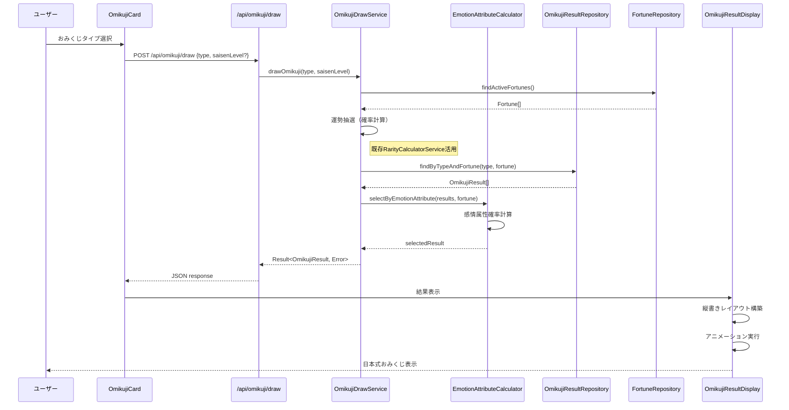
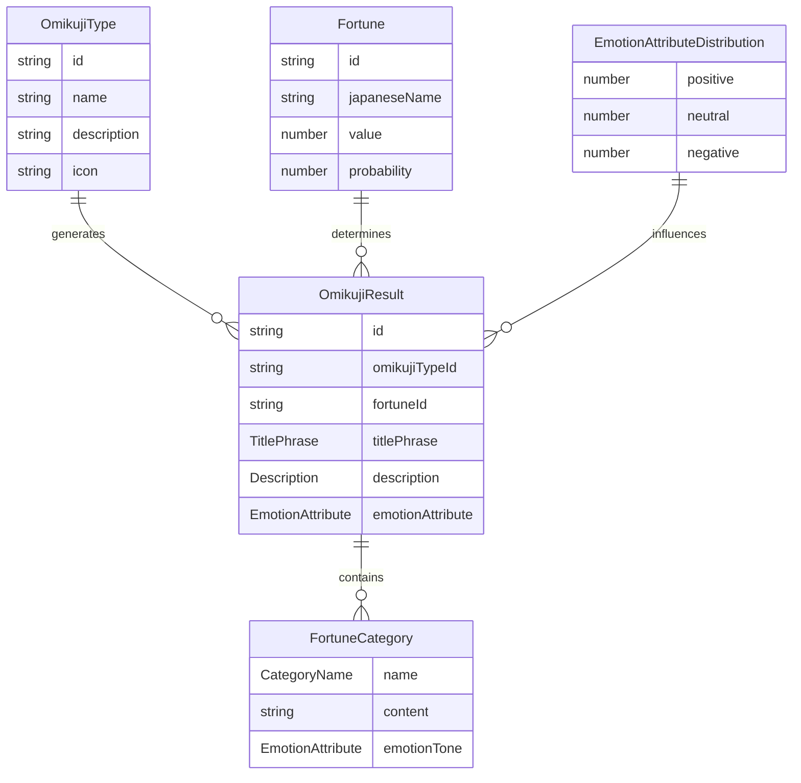

# Technical Design Document: おみくじ結果表示システム

## Overview

本機能は、エンジニア向けおみくじサービスにおいて、各おみくじタイプと運勢の組み合わせに対して多様で魅力的な結果コンテンツを管理・表示するシステムです。日本の伝統的なおみくじ体験を現代的に再現しつつ、エンジニア特有のユーモアと実用性を融合させた結果表示機能を提供します。

**Users**: システム管理者が結果データを管理し、ユーザーがおみくじを引いて多様な結果を体験し、コンテンツ企画者がエンジニア向け特化コンテンツを定義します。

**Impact**: 現在のおみくじ選択システムを拡張し、実際の結果生成・表示機能を追加して完全なおみくじ体験を実現します。

### Goals

- 各おみくじタイプ・運勢組み合わせに複数結果バリエーション提供
- 感情属性（ポジティブ・ネガティブ・ニュートラル）による確率的結果選択
- 日本の伝統的なおみくじ形式を模した視覚的に魅力的な結果表示
- エンジニア文化に特化したユーモアと専門性を持つコンテンツ
- 既存システムとのシームレスな統合と後方互換性

### Non-Goals

- リアルタイム結果共有機能（将来フェーズで実装）
- ユーザー履歴・統計機能（既存計画外）
- 複数言語対応（日本語専用）
- 外部API連携による動的コンテンツ生成

## Requirements Traceability

| Requirement | Summary | Components | Interfaces | Flows |
|-------------|---------|------------|------------|-------|
| 1.1, 1.2, 1.3, 1.4 | おみくじ結果データ管理 | OmikujiResultRepository, OmikujiResultData | Repository, API | データ読み込み |
| 1.5, 1.6, 1.7 | 結果データ構造定義 | OmikujiResult, FortuneCategory | Domain Models | - |
| 2.1, 2.2, 2.3, 2.4, 2.5 | 確率的結果選択ロジック | OmikujiDrawService, EmotionAttributeCalculator | Service | 抽選フロー |
| 3.1, 3.2, 3.3, 3.4, 3.5 | 感情属性表現システム | EmotionAttributeDistribution | Service | 確率計算 |
| 4.1, 4.2, 4.3, 4.4, 4.5, 4.6 | 日本式縦書きUI表現 | OmikujiResultDisplay, TraditionalLayout | UI Components | 結果表示 |
| 5.1-5.18 | エンジニア特化コンテンツ | ContentDefinition, EngineerTheme | Data Models | - |
| 6.1, 6.2, 6.3, 6.4, 6.5, 6.6 | 既存システム統合 | ApiIntegration, TypeScript型拡張 | API, State | システム連携 |

## Architecture

### Existing Architecture Analysis

現在のシステムは完全なClean Architecture + DDDパターンで構築されており、以下の確立された基盤があります：

- **ドメイン層**: Fortune値オブジェクト、OmikujiType エンティティが定義済み
- **インフラ層**: JsonFortuneRepository による JSON ファイルベースデータアクセス
- **プレゼンテーション層**: Next.js App Router、React 19、Tailwind CSS による統合ページ
- **API層**: `/api/fortune/types` による RESTful エンドポイント

既存の運勢システム（大吉〜大凶）と確率計算基盤（RarityCalculatorService）は完全に機能しており、新機能はこれらを活用・拡張します。

### Architecture Pattern & Boundary Map

```mermaid
graph TB
    Client[クライアント] --> ResultAPI[/api/omikuji/draw]
    Client --> ResultUI[結果表示UI]
    
    ResultAPI --> DrawService[OmikujiDrawService]
    ResultUI --> ResultDisplay[OmikujiResultDisplay]
    
    DrawService --> FortuneRepo[FortuneRepository]
    DrawService --> ResultRepo[OmikujiResultRepository] 
    DrawService --> AttributeCalc[EmotionAttributeCalculator]
    
    ResultDisplay --> ResultState[結果状態管理]
    ResultDisplay --> LayoutEngine[TraditionalLayoutEngine]
    
    ResultRepo --> ResultData[(結果データJSON)]
    FortuneRepo --> FortuneData[(運勢データJSON)]
    
    subgraph "ドメイン境界"
        DrawService
        AttributeCalc
        OmikujiResult[OmikujiResult実体]
    end
    
    subgraph "プレゼンテーション境界"  
        ResultUI
        ResultDisplay
        LayoutEngine
    end
    
    subgraph "インフラ境界"
        ResultRepo 
        FortuneRepo
        ResultData
    end
```

**Architecture Integration**:
- **Selected pattern**: 既存Clean Architecture拡張（ドメイン駆動設計継続）
- **Domain/feature boundaries**: 結果管理ドメインを独立境界として分離、既存Fortune境界は保持
- **Existing patterns preserved**: Repository パターン、Value Object 設計、JSON-First データ管理
- **New components rationale**: 結果選択の複雑なビジネスルール管理と伝統的UI表現の専門性
- **Steering compliance**: 技術スタック（Next.js/React 19）、DDD原則、テスト駆動開発を維持

### Technology Stack

| Layer | Choice / Version | Role in Feature | Notes |
|-------|------------------|-----------------|-------|
| Frontend | React 19.2.3, Next.js 16.1.1 | 結果表示コンポーネント、状態管理 | 既存統合、App Router継続 |
| Backend | Next.js API Routes | おみくじ抽選エンドポイント | 既存Fortune APIパターン踏襲 |
| Data | JSON ファイル + Repositoryパターン | 結果データ管理、既存Fortune連携 | MVP迅速実装、既存一貫性 |
| Styling | Tailwind CSS 4, CSS writing-mode | 日本式縦書きレイアウト、レスポンシブ対応 | 伝統的表現と現代技術の融合 |
| Animation | Framer Motion 12.23+ | 結果表示アニメーション、おみくじ演出 | 既存アニメーション基盤活用 |
| Type Safety | TypeScript strict, Result<T,E>型 | エラーハンドリング、ドメインモデル型安全性 | 2024年ベストプラクティス採用 |
| Testing | Vitest 4, React Testing Library 16+ | 確率分布検証、UIアクセシビリティテスト | 既存テスト基盤統合 |

## System Flows

### おみくじ抽選・結果表示フロー



**Key Decisions**: 
- 二段階選択ロジック（運勢→感情属性）による要件仕様準拠
- Result型による型安全なエラーハンドリング  
- 既存Fortune確率システムの活用と拡張

## Components and Interfaces

| Component | Domain/Layer | Intent | Req Coverage | Key Dependencies | Contracts |
|-----------|--------------|--------|--------------|-----------------|-----------|
| OmikujiDrawService | ドメイン | おみくじ抽選ビジネスロジック | 2.1, 2.2, 2.4 | FortuneRepository (P0), OmikujiResultRepository (P0) | Service |
| EmotionAttributeCalculator | ドメイン | 感情属性による確率計算 | 2.2, 3.1-3.5, 5.10-5.13 | - | Service |
| OmikujiResultRepository | インフラ | 結果データアクセス | 1.1-1.7, 6.2 | JSON files (P0) | Service |
| OmikujiResultDisplay | プレゼンテーション | 日本式縦書き結果表示 | 4.1-4.6 | TraditionalLayoutEngine (P1) | State |
| TraditionalLayoutEngine | プレゼンテーション | CSS縦書きレイアウト生成 | 4.1, 4.3, 4.6 | CSS writing-mode (P0) | Service |

### ドメイン層

#### OmikujiDrawService

| Field | Detail |
|-------|--------|
| Intent | おみくじタイプと運勢の組み合わせから適切な結果を抽選選択する |
| Requirements | 2.1, 2.2, 2.3, 2.4, 2.5 |
| Owner / Reviewers | Backend team |

**Responsibilities & Constraints**
- おみくじ抽選の核心ビジネスロジック（運勢決定→結果選択）
- 感情属性による確率分布の適用とランダム選択
- エラー時のデフォルト結果提供とフォールバック処理

**Dependencies**
- Inbound: API Routes — HTTP抽選リクエスト処理 (P0)
- Outbound: FortuneRepository — 運勢確率データ取得 (P0) 
- Outbound: OmikujiResultRepository — 結果候補データ取得 (P0)
- Outbound: EmotionAttributeCalculator — 感情属性確率計算 (P0)

**Contracts**: Service [✓]

##### Service Interface
```typescript
interface OmikujiDrawService {
  drawOmikuji(typeId: string, saisenLevel?: number): Promise<Result<OmikujiResult, DrawError>>;
  calculateFortuneDistribution(typeId: string): Result<FortuneDistribution, ValidationError>;
}

type DrawError = 
  | { type: 'FORTUNE_DATA_NOT_FOUND'; typeId: string }
  | { type: 'RESULT_DATA_NOT_FOUND'; typeId: string; fortuneId: string }
  | { type: 'INVALID_PROBABILITY_DISTRIBUTION'; details: string };

interface FortuneDistribution {
  fortunes: { id: string; probability: number }[];
  totalProbability: number;
}
```
- **Preconditions**: typeIdは既存OmikujiTypeと一致、saisenLevelは0-5範囲
- **Postconditions**: 有効なOmikujiResultまたは具体的なエラー情報を返却
- **Invariants**: 確率の総和は1.0、選択された結果は指定typeId・fortuneと一致

#### EmotionAttributeCalculator

| Field | Detail |
|-------|--------|
| Intent | 運勢レベルに応じた感情属性確率分布の計算と適用 |
| Requirements | 2.2, 3.1, 3.2, 3.3, 3.4, 3.5, 5.10, 5.11, 5.12, 5.13 |

**Responsibilities & Constraints**
- 運勢レベル（大吉〜大凶）ごとの感情属性確率マトリックス管理
- ポジティブ・ネガティブ・ニュートラル属性の重み付き選択実行
- 確率分布の検証とバリデーション

**Dependencies**
- Inbound: OmikujiDrawService — 感情属性選択要求 (P0)
- External: Math.random() — 疑似乱数生成 (P0)

**Contracts**: Service [✓]

##### Service Interface
```typescript
interface EmotionAttributeCalculator {
  selectByEmotionAttribute(
    results: OmikujiResult[], 
    fortune: Fortune
  ): Result<OmikujiResult, SelectionError>;
  
  getEmotionDistribution(fortuneValue: number): EmotionDistribution;
}

interface EmotionDistribution {
  positive: number;  // 0.0-1.0
  neutral: number;   // 0.0-1.0  
  negative: number;  // 0.0-1.0
}

type SelectionError =
  | { type: 'NO_RESULTS_PROVIDED'; resultsCount: number }
  | { type: 'INVALID_EMOTION_DISTRIBUTION'; distribution: EmotionDistribution }
  | { type: 'NO_MATCHING_EMOTION_RESULTS'; emotion: EmotionAttribute };
```

**Implementation Notes**
- **Integration**: 確率分布テーブルは設定ファイル外部化を検討、ハードコード回避
- **Validation**: 感情属性確率の合計値が1.0であることを実行時チェック
- **Risks**: 確率分布設定ミス対策として可視化ツール導入を推奨

#### OmikujiResult

| Field | Detail |
|-------|--------|
| Intent | 単一のおみくじ結果エンティティ（タイトル・説明・項目を含む） |
| Requirements | 1.4, 1.5, 5.1-5.18 |

**Domain Model**:
```typescript
interface OmikujiResult {
  id: string;
  omikujiTypeId: string;
  fortuneId: string;
  titlePhrase: string;        // 20-40文字の目を引くフレーズ
  description: string;        // 100-300文字の詳細説明
  emotionAttribute: EmotionAttribute;
  categories: FortuneCategory[];
}

interface FortuneCategory {
  name: CategoryName;         // '恋愛運' | '仕事運' | '健康運' | '金運' | '学業運'
  content: string;           // エンジニア特化表現コンテンツ
  emotionTone: EmotionAttribute;
}

type EmotionAttribute = 'positive' | 'neutral' | 'negative';
type CategoryName = '恋愛運' | '仕事運' | '健康運' | '金運' | '学業運';
```

### インフラ層

#### OmikujiResultRepository

| Field | Detail |
|-------|--------|
| Intent | 結果データのJSONファイルベース永続化と取得 |
| Requirements | 1.1, 1.2, 1.3, 1.6, 1.7, 6.2, 6.6 |

**Responsibilities & Constraints**
- おみくじタイプごとの独立JSONファイル管理（`data/results/`）
- 運勢・感情属性による結果フィルタリング機能
- 既存Repositoryパターンとの一貫性維持

**Dependencies**
- Inbound: OmikujiDrawService — 結果データ取得要求 (P0)
- External: Next.js File System API — JSONファイル読み込み (P0)
- External: `/api/omikuji/results` — クライアントサイド用API (P1)

**Contracts**: Service [✓]

##### Service Interface
```typescript
interface IOmikujiResultRepository {
  findByTypeAndFortune(typeId: string, fortuneId: string): Promise<Result<OmikujiResult[], RepositoryError>>;
  findByEmotionAttribute(typeId: string, fortuneId: string, emotion: EmotionAttribute): Promise<Result<OmikujiResult[], RepositoryError>>;
  findAll(typeId: string): Promise<Result<OmikujiResult[], RepositoryError>>;
}

class JsonOmikujiResultRepository implements IOmikujiResultRepository {
  private async loadResultData(typeId: string): Promise<OmikujiResultData>;
  private getDefaultResults(typeId: string): OmikujiResult[];
}
```

### プレゼンテーション層

#### OmikujiResultDisplay

| Field | Detail |
|-------|--------|
| Intent | 日本の伝統的なおみくじ形式による結果表示UI |
| Requirements | 4.1, 4.2, 4.3, 4.4, 4.5, 4.6 |

**Responsibilities & Constraints**
- CSS writing-modeによる縦書きレイアウト実装
- 運勢レベルに応じた色彩・エフェクト差別化
- モバイル・デスクトップ両対応レスポンシブデザイン

**Dependencies**
- Inbound: おみくじ抽選完了画面 — 結果表示要求 (P0)
- Outbound: TraditionalLayoutEngine — 縦書きスタイル生成 (P1)
- External: Framer Motion — 表示アニメーション (P1)

**Contracts**: State [✓]

##### State Management
```typescript
interface OmikujiResultState {
  result: OmikujiResult | null;
  displayMode: 'traditional' | 'modern';
  animationState: 'hidden' | 'revealing' | 'displayed';
  layoutOrientation: 'vertical' | 'horizontal';
}

interface OmikujiResultDisplayProps {
  result: OmikujiResult;
  onClose?: () => void;
  autoAnimate?: boolean;
}
```

**Implementation Notes**
- **Integration**: 既存SmoothTransitions・MysteriousAppearanceアニメーション活用
- **Validation**: 縦書き非対応ブラウザ向けフォールバック横書きモード実装
- **Risks**: CSS writing-mode対応状況の継続監視、Progressive Enhancement適用

## BDD Scenarios & Domain Behavior Definition

### Core User Stories with BDD Scenarios

#### Feature: おみくじ結果抽選システム

**Story**: As a ユーザー, I want おみくじを引いて多様な結果を体験する So that エンジニアライフの楽しみを得られる

```gherkin
Scenario: 大吉系運勢でポジティブな結果を取得
  Given エンジニア運勢おみくじが選択されている
  And 運勢データに大吉（value: 4, probability: 0.03）が定義されている
  And 大吉の結果として以下の感情属性分布が設定されている:
    | emotion  | probability |
    | positive | 0.80        |
    | neutral  | 0.15        |
    | negative | 0.05        |
  When ユーザーがおみくじを引く
  Then 運勢として大吉が選択される確率は3%である
  And 大吉が選択された場合、80%の確率でポジティブな結果が表示される
  And 結果のタイトルフレーズは20-40文字の範囲内である
  And 結果の説明は100-300文字の範囲内である
  And 5つの運勢項目（恋愛運・仕事運・健康運・金運・学業運）すべてが含まれる

Scenario: 凶系運勢でネガティブながら愛のある表現を取得
  Given エンジニア運勢おみくじが選択されている
  And 運勢データに凶（value: -1, probability: 0.15）が定義されている
  When ユーザーがおみくじを引いて凶が選択される
  Then 60%の確率でネガティブ属性の結果が選択される
  And 結果には厳しくも愛のある表現が含まれる
  And エンジニア特有の自虐的ユーモアが表現に含まれる
  And デバッグ地獄やマージコンフリクトなどの技術的困難が言及される

Scenario: 同一運勢で異なる結果のバリエーション確認
  Given 中吉の運勢に対して3つ以上の結果バリエーションが定義されている
  When 同じユーザーが中吉を10回引く
  Then 10回中少なくとも2つ以上の異なる結果が表示される
  And すべての結果が中吉に対応した内容である
  And 感情属性の分布が期待される確率に近似する

Scenario: データが見つからない場合のフォールバック動作
  Given 指定されたおみくじタイプに結果データが存在しない
  When ユーザーがそのおみくじを引く
  Then デフォルトの汎用結果が返される
  And エラーログが記録される
  And ユーザーには自然な結果として表示される
```

#### Feature: 感情属性による確率分布システム

```gherkin
Scenario: 運勢レベルに応じた感情属性確率の適用
  Given 以下の感情属性確率設定がある:
    | fortune | positive | neutral | negative |
    | 大吉    | 0.80     | 0.15    | 0.05     |
    | 吉      | 0.60     | 0.30    | 0.10     |
    | 凶      | 0.15     | 0.25    | 0.60     |
  When 1000回の抽選シミュレーションを実行する
  Then 各感情属性の出現頻度が期待確率の±5%以内に収束する
  And 確率の合計が必ず1.0である

Scenario: 感情属性に対応しない結果の処理
  Given ある運勢にポジティブ属性の結果が定義されていない
  When その運勢でポジティブ結果が選択される必要がある
  Then ニュートラル属性の結果から代替選択が行われる
  And フォールバック動作がログに記録される
```

### Domain Model with Behavioral Specifications

#### OmikujiResult Entity

```typescript
/**
 * おみくじ結果エンティティ
 * 
 * 責務: 単一のおみくじ結果の表現と妥当性保証
 * 不変条件: タイトル・説明の文字数制限、5項目の完全性
 */
class OmikujiResult {
  private constructor(
    private readonly id: OmikujiResultId,
    private readonly omikujiTypeId: string,
    private readonly fortuneId: string,
    private readonly titlePhrase: TitlePhrase,
    private readonly description: Description,
    private readonly emotionAttribute: EmotionAttribute,
    private readonly categories: FortuneCategoryCollection
  ) {}

  static create(params: OmikujiResultCreateParams): Result<OmikujiResult, DomainError> {
    // 振る舞い: 不変条件の検証とエンティティ生成
    const titlePhrase = TitlePhrase.create(params.titlePhrase);
    const description = Description.create(params.description);
    const categories = FortuneCategoryCollection.create(params.categories);

    if (titlePhrase.isError()) return Result.error(titlePhrase.error);
    if (description.isError()) return Result.error(description.error);
    if (categories.isError()) return Result.error(categories.error);

    return Result.success(new OmikujiResult(
      OmikujiResultId.create(params.id),
      params.omikujiTypeId,
      params.fortuneId,
      titlePhrase.value,
      description.value,
      params.emotionAttribute,
      categories.value
    ));
  }

  // 振る舞い: エンジニア特化表現の検証
  hasEngineerSpecificContent(): boolean {
    const engineerTerms = ['コード', 'バグ', 'デプロイ', 'リファクタ', 'マージ', 'プルリク'];
    const content = this.getCombinedContent();
    return engineerTerms.some(term => content.includes(term));
  }

  // 振る舞い: 感情属性の一貫性検証
  isEmotionConsistent(): boolean {
    return this.categories.areEmotionsConsistentWith(this.emotionAttribute);
  }

  // 振る舞い: 完全性の検証
  isComplete(): boolean {
    return this.categories.hasAllRequiredCategories() && 
           this.titlePhrase.isValid() && 
           this.description.isValid();
  }

  // 振る舞い: 表示用コンテンツの統合
  private getCombinedContent(): string {
    return this.titlePhrase.getValue() + ' ' + this.description.getValue() + 
           ' ' + this.categories.getCombinedContent();
  }
}
```

#### TitlePhrase Value Object

```typescript
/**
 * おみくじタイトルフレーズ値オブジェクト
 * 
 * 責務: 20-40文字制限の保証、目を引く表現の妥当性
 * 不変条件: 文字数範囲、空白文字のみの禁止
 */
class TitlePhrase {
  private static readonly MIN_LENGTH = 20;
  private static readonly MAX_LENGTH = 40;

  private constructor(private readonly value: string) {}

  static create(value: string): Result<TitlePhrase, ValidationError> {
    // 振る舞い: 文字数制限の検証
    if (value.trim().length < this.MIN_LENGTH) {
      return Result.error(
        ValidationError.create('TITLE_TOO_SHORT', 
          `タイトルは${this.MIN_LENGTH}文字以上必要です。現在: ${value.length}文字`)
      );
    }

    if (value.trim().length > this.MAX_LENGTH) {
      return Result.error(
        ValidationError.create('TITLE_TOO_LONG',
          `タイトルは${this.MAX_LENGTH}文字以下にしてください。現在: ${value.length}文字`)
      );
    }

    // 振る舞い: 目を引く表現の基本検証
    if (!this.isEyeCatching(value)) {
      return Result.error(
        ValidationError.create('TITLE_NOT_EYE_CATCHING',
          'タイトルは感嘆符や特徴的な表現を含む必要があります')
      );
    }

    return Result.success(new TitlePhrase(value.trim()));
  }

  // 振る舞い: 目を引く表現の判定
  private static isEyeCatching(value: string): boolean {
    const eyeCatchingPatterns = [
      /[！!]/, // 感嘆符
      /[神最高絶対完璧究極]/, // 極端な表現
      /.*(今日|本日).*(日|時)/, // 時間的特別感
      /[✨🌟⚡🎯🚀💫]/ // 装飾文字
    ];
    
    return eyeCatchingPatterns.some(pattern => pattern.test(value));
  }

  getValue(): string {
    return this.value;
  }

  isValid(): boolean {
    return this.value.length >= TitlePhrase.MIN_LENGTH && 
           this.value.length <= TitlePhrase.MAX_LENGTH;
  }
}
```

#### EmotionAttributeDistribution Value Object

```typescript
/**
 * 感情属性確率分布値オブジェクト
 * 
 * 責務: 感情属性確率の数学的正確性保証
 * 不変条件: 確率合計1.0、各確率0.0-1.0範囲
 */
class EmotionAttributeDistribution {
  private constructor(
    private readonly positive: number,
    private readonly neutral: number,
    private readonly negative: number
  ) {}

  static create(
    positive: number, 
    neutral: number, 
    negative: number
  ): Result<EmotionAttributeDistribution, ValidationError> {
    
    // 振る舞い: 確率値の範囲検証
    if (!this.isValidProbability(positive) || 
        !this.isValidProbability(neutral) || 
        !this.isValidProbability(negative)) {
      return Result.error(
        ValidationError.create('INVALID_PROBABILITY_RANGE',
          '確率は0.0から1.0の範囲で指定してください')
      );
    }

    // 振る舞い: 確率合計の検証
    const total = positive + neutral + negative;
    if (Math.abs(total - 1.0) > 0.0001) {
      return Result.error(
        ValidationError.create('PROBABILITY_SUM_INVALID',
          `確率の合計は1.0である必要があります。現在の合計: ${total}`)
      );
    }

    return Result.success(new EmotionAttributeDistribution(positive, neutral, negative));
  }

  // 振る舞い: 確率による感情属性選択
  selectEmotionAttribute(randomValue: number): EmotionAttribute {
    if (randomValue < this.positive) {
      return EmotionAttribute.POSITIVE;
    } else if (randomValue < this.positive + this.neutral) {
      return EmotionAttribute.NEUTRAL;
    } else {
      return EmotionAttribute.NEGATIVE;
    }
  }

  // 振る舞い: 運勢レベルに基づいた確率分布生成
  static forFortuneLevel(fortuneValue: number): EmotionAttributeDistribution {
    if (fortuneValue >= 3) { // 大吉・中吉
      return this.create(0.80, 0.15, 0.05).unwrap();
    } else if (fortuneValue >= 1) { // 吉・小吉
      return this.create(0.60, 0.30, 0.10).unwrap();
    } else if (fortuneValue === 0) { // 末吉
      return this.create(0.30, 0.50, 0.20).unwrap();
    } else { // 凶・大凶
      return this.create(0.15, 0.25, 0.60).unwrap();
    }
  }

  private static isValidProbability(value: number): boolean {
    return value >= 0.0 && value <= 1.0;
  }
}
```

#### FortuneCategoryCollection Value Object

```typescript
/**
 * 運勢項目集合値オブジェクト
 * 
 * 責務: 5項目（恋愛運・仕事運・健康運・金運・学業運）の完全性保証
 * 不変条件: 必須5項目の存在、重複なし、空コンテンツなし
 */
class FortuneCategoryCollection {
  private static readonly REQUIRED_CATEGORIES: CategoryName[] = [
    '恋愛運', '仕事運', '健康運', '金運', '学業運'
  ];

  private constructor(
    private readonly categories: Map<CategoryName, FortuneCategory>
  ) {}

  static create(
    categoryData: FortuneCategoryData[]
  ): Result<FortuneCategoryCollection, ValidationError> {
    
    const categoryMap = new Map<CategoryName, FortuneCategory>();

    // 振る舞い: 各項目の妥当性検証
    for (const data of categoryData) {
      const category = FortuneCategory.create(data);
      if (category.isError()) {
        return Result.error(category.error);
      }
      categoryMap.set(data.name, category.value);
    }

    // 振る舞い: 必須項目の完全性検証
    const missingCategories = this.REQUIRED_CATEGORIES.filter(
      required => !categoryMap.has(required)
    );

    if (missingCategories.length > 0) {
      return Result.error(
        ValidationError.create('MISSING_REQUIRED_CATEGORIES',
          `以下の必須項目が不足しています: ${missingCategories.join(', ')}`)
      );
    }

    return Result.success(new FortuneCategoryCollection(categoryMap));
  }

  // 振る舞い: 感情属性の一貫性検証
  areEmotionsConsistentWith(primaryEmotion: EmotionAttribute): boolean {
    const categoryEmotions = Array.from(this.categories.values())
      .map(category => category.getEmotionTone());
    
    const primaryEmotionCount = categoryEmotions.filter(
      emotion => emotion === primaryEmotion
    ).length;

    // 過半数が主感情属性と一致している場合は一貫性あり
    return primaryEmotionCount >= Math.ceil(categoryEmotions.length / 2);
  }

  // 振る舞い: エンジニア特化表現の検証
  hasEngineerSpecificExpressions(): boolean {
    return Array.from(this.categories.values()).every(category =>
      category.hasEngineerSpecificContent()
    );
  }

  hasAllRequiredCategories(): boolean {
    return FortuneCategoryCollection.REQUIRED_CATEGORIES.every(
      required => this.categories.has(required)
    );
  }

  getCombinedContent(): string {
    return Array.from(this.categories.values())
      .map(category => category.getContent())
      .join(' ');
  }
}
```

### Domain Service Behavioral Specifications

#### OmikujiDrawService Domain Service

```typescript
/**
 * おみくじ抽選ドメインサービス
 * 
 * 責務: おみくじ抽選のコアビジネスロジック実行
 * 不変条件: 確率分布の正確性、結果の完全性保証
 */
class OmikujiDrawService {
  constructor(
    private readonly fortuneRepository: IFortuneRepository,
    private readonly resultRepository: IOmikujiResultRepository,
    private readonly attributeCalculator: EmotionAttributeCalculator
  ) {}

  // 振る舞い: メインのおみくじ抽選実行
  async drawOmikuji(typeId: string, saisenLevel: number = 0): Promise<Result<OmikujiResult, DrawError>> {
    // 運勢データの取得と検証
    const fortunesResult = await this.getValidatedFortunes();
    if (fortunesResult.isError()) {
      return Result.error(DrawError.fortuneDataNotFound(typeId));
    }

    // 運勢の確率的選択
    const selectedFortune = this.selectFortuneByProbability(fortunesResult.value, saisenLevel);
    
    // 該当結果の取得
    const resultsResult = await this.resultRepository.findByTypeAndFortune(typeId, selectedFortune.getId());
    if (resultsResult.isError() || resultsResult.value.length === 0) {
      return await this.getDefaultResult(typeId, selectedFortune.getId());
    }

    // 感情属性による結果選択
    const finalResult = this.attributeCalculator.selectByEmotionAttribute(
      resultsResult.value, 
      selectedFortune
    );

    return finalResult;
  }

  // 振る舞い: お賽銭レベルに応じた運勢確率調整
  private adjustProbabilityBySaisen(fortunes: Fortune[], saisenLevel: number): Fortune[] {
    if (saisenLevel === 0) return fortunes;

    // お賽銭レベルに応じて良い運勢の確率を向上させる
    return fortunes.map(fortune => {
      if (fortune.isGoodFortune()) {
        const boost = saisenLevel * 0.1; // 10%ずつ向上
        const newProbability = Math.min(fortune.getProbability() * (1 + boost), 1.0);
        return fortune.withUpdatedProbability(newProbability);
      }
      return fortune;
    });
  }

  // 振る舞い: 運勢の確率的選択（累積重み法）
  private selectFortuneByProbability(fortunes: Fortune[], saisenLevel: number): Fortune {
    const adjustedFortunes = this.adjustProbabilityBySaisen(fortunes, saisenLevel);
    const cumulativeProbabilities = this.calculateCumulativeProbabilities(adjustedFortunes);
    const randomValue = Math.random();

    for (let i = 0; i < cumulativeProbabilities.length; i++) {
      if (randomValue < cumulativeProbabilities[i]) {
        return adjustedFortunes[i];
      }
    }

    // フォールバック：最後の運勢を返す
    return adjustedFortunes[adjustedFortunes.length - 1];
  }

  // 振る舞い: 累積確率の計算
  private calculateCumulativeProbabilities(fortunes: Fortune[]): number[] {
    let cumulative = 0;
    return fortunes.map(fortune => {
      cumulative += fortune.getProbability();
      return cumulative;
    });
  }

  // 振る舞い: フォールバック結果の生成
  private async getDefaultResult(typeId: string, fortuneId: string): Promise<Result<OmikujiResult, DrawError>> {
    const defaultTitle = "今日もコーディングを楽しもう！";
    const defaultDescription = "予期せぬ出来事もあるかもしれませんが、エンジニアとしての成長のチャンスと捉えて前進しましょう。";
    
    const defaultCategories = [
      { name: '恋愛運', content: 'ペアプロで新しい出会いがあるかも', emotionTone: 'neutral' },
      { name: '仕事運', content: '着実にタスクを進めることができそう', emotionTone: 'neutral' },
      { name: '健康運', content: '適度な休憩を心がけましょう', emotionTone: 'neutral' },
      { name: '金運', content: '堅実な技術投資が功を奏する', emotionTone: 'neutral' },
      { name: '学業運', content: '新しい技術の学習に良い日', emotionTone: 'neutral' }
    ];

    return OmikujiResult.create({
      id: `default-${typeId}-${fortuneId}`,
      omikujiTypeId: typeId,
      fortuneId: fortuneId,
      titlePhrase: defaultTitle,
      description: defaultDescription,
      emotionAttribute: EmotionAttribute.NEUTRAL,
      categories: defaultCategories
    });
  }
}
```

### TDD Test Scenarios

#### OmikujiDrawService BDD Tests

```typescript
describe('OmikujiDrawService', () => {
  describe('おみくじ抽選の基本動作', () => {
    it('有効なおみくじタイプで抽選を実行できる', async () => {
      // Given
      const service = new OmikujiDrawService(mockFortuneRepo, mockResultRepo, mockAttributeCalc);
      const typeId = 'engineer-fortune';
      
      // When
      const result = await service.drawOmikuji(typeId);
      
      // Then
      expect(result.isSuccess()).toBe(true);
      expect(result.value.omikujiTypeId).toBe(typeId);
      expect(result.value.isComplete()).toBe(true);
    });

    it('存在しないおみくじタイプで適切なエラーを返す', async () => {
      // Given
      const service = new OmikujiDrawService(mockFortuneRepo, mockResultRepo, mockAttributeCalc);
      const invalidTypeId = 'nonexistent-fortune';
      
      // When
      const result = await service.drawOmikuji(invalidTypeId);
      
      // Then
      expect(result.isError()).toBe(true);
      expect(result.error.type).toBe('FORTUNE_DATA_NOT_FOUND');
      expect(result.error.typeId).toBe(invalidTypeId);
    });
  });

  describe('確率分布の正確性', () => {
    it('10000回の抽選で期待確率に収束する', async () => {
      // Given
      const service = new OmikujiDrawService(mockFortuneRepo, mockResultRepo, mockAttributeCalc);
      const typeId = 'engineer-fortune';
      const iterations = 10000;
      const fortuneDistribution = new Map<string, number>();
      
      // When
      for (let i = 0; i < iterations; i++) {
        const result = await service.drawOmikuji(typeId);
        if (result.isSuccess()) {
          const fortuneId = result.value.fortuneId;
          fortuneDistribution.set(fortuneId, (fortuneDistribution.get(fortuneId) || 0) + 1);
        }
      }
      
      // Then
      const daikichCount = fortuneDistribution.get('daikichi') || 0;
      const daikichProbability = daikichCount / iterations;
      const expectedProbability = 0.03;
      const tolerance = 0.01;
      
      expect(daikichProbability).toBeCloseTo(expectedProbability, tolerance);
    });
  });

  describe('感情属性による結果選択', () => {
    it('大吉でポジティブな結果が80%の確率で選択される', async () => {
      // Given
      const mockResultRepo = createMockResultRepository();
      mockResultRepo.setupDaikichResults([
        createMockResult('daikichi-positive-1', EmotionAttribute.POSITIVE),
        createMockResult('daikichi-positive-2', EmotionAttribute.POSITIVE),
        createMockResult('daikichi-neutral-1', EmotionAttribute.NEUTRAL),
        createMockResult('daikichi-negative-1', EmotionAttribute.NEGATIVE)
      ]);
      
      const service = new OmikujiDrawService(mockFortuneRepo, mockResultRepo, realAttributeCalc);
      const iterations = 1000;
      let positiveCount = 0;
      
      // When
      for (let i = 0; i < iterations; i++) {
        // Force daikichi selection for this test
        const result = await service.drawSpecificFortune('engineer-fortune', 'daikichi');
        if (result.isSuccess() && result.value.emotionAttribute === EmotionAttribute.POSITIVE) {
          positiveCount++;
        }
      }
      
      // Then
      const positiveRate = positiveCount / iterations;
      expect(positiveRate).toBeCloseTo(0.80, 0.05);
    });
  });
});
```

#### TitlePhrase BDD Tests

```typescript
describe('TitlePhrase Value Object', () => {
  describe('文字数制限の検証', () => {
    it('20文字未満の場合はエラーを返す', () => {
      // Given
      const shortTitle = '短いタイトル';  // 6文字
      
      // When
      const result = TitlePhrase.create(shortTitle);
      
      // Then
      expect(result.isError()).toBe(true);
      expect(result.error.code).toBe('TITLE_TOO_SHORT');
      expect(result.error.message).toContain('20文字以上必要');
    });

    it('40文字を超える場合はエラーを返す', () => {
      // Given
      const longTitle = 'このタイトルは40文字を大幅に超える非常に長いタイトルフレーズです'; // 41文字
      
      // When
      const result = TitlePhrase.create(longTitle);
      
      // Then
      expect(result.isError()).toBe(true);
      expect(result.error.code).toBe('TITLE_TOO_LONG');
      expect(result.error.message).toContain('40文字以下');
    });

    it('20-40文字の範囲内で目を引く表現がある場合は成功する', () => {
      // Given
      const validTitle = '今日は神コードが降臨する最高の一日！'; // 21文字、感嘆符あり
      
      // When
      const result = TitlePhrase.create(validTitle);
      
      // Then
      expect(result.isSuccess()).toBe(true);
      expect(result.value.getValue()).toBe(validTitle);
    });
  });

  describe('目を引く表現の検証', () => {
    it('感嘆符がない平坦な表現はエラーとなる', () => {
      // Given
      const plainTitle = '今日はコーディングに関する運勢です'; // 20文字、平坦
      
      // When
      const result = TitlePhrase.create(plainTitle);
      
      // Then
      expect(result.isError()).toBe(true);
      expect(result.error.code).toBe('TITLE_NOT_EYE_CATCHING');
    });

    it('極端な表現がある場合は成功する', () => {
      // Given
      const extremeTitle = 'バグゼロでリリース完璧な神の一日'; // 20文字、「完璧」「神」の極端表現
      
      // When
      const result = TitlePhrase.create(extremeTitle);
      
      // Then
      expect(result.isSuccess()).toBe(true);
    });
  });
});
```

#### EmotionAttributeDistribution BDD Tests

```typescript
describe('EmotionAttributeDistribution Value Object', () => {
  describe('確率分布の妥当性検証', () => {
    it('合計が1.0の場合は成功する', () => {
      // Given
      const validDistribution = [0.6, 0.3, 0.1]; // 合計1.0
      
      // When
      const result = EmotionAttributeDistribution.create(...validDistribution);
      
      // Then
      expect(result.isSuccess()).toBe(true);
    });

    it('合計が1.0でない場合はエラーを返す', () => {
      // Given
      const invalidDistribution = [0.7, 0.3, 0.2]; // 合計1.2
      
      // When
      const result = EmotionAttributeDistribution.create(...invalidDistribution);
      
      // Then
      expect(result.isError()).toBe(true);
      expect(result.error.code).toBe('PROBABILITY_SUM_INVALID');
      expect(result.error.message).toContain('1.0である必要');
    });

    it('範囲外の確率でエラーを返す', () => {
      // Given
      const outOfRangeDistribution = [1.5, -0.3, -0.2]; // 範囲外
      
      // When
      const result = EmotionAttributeDistribution.create(...outOfRangeDistribution);
      
      // Then
      expect(result.isError()).toBe(true);
      expect(result.error.code).toBe('INVALID_PROBABILITY_RANGE');
    });
  });

  describe('運勢レベル別確率分布生成', () => {
    it('大吉の場合は80%ポジティブの分布を生成する', () => {
      // Given
      const daikichiFortune = 4; // 大吉のvalue値
      
      // When
      const distribution = EmotionAttributeDistribution.forFortuneLevel(daikichiFortune);
      
      // Then
      expect(distribution.getPositiveProbability()).toBe(0.80);
      expect(distribution.getNeutralProbability()).toBe(0.15);
      expect(distribution.getNegativeProbability()).toBe(0.05);
    });

    it('凶の場合は60%ネガティブの分布を生成する', () => {
      // Given
      const kyoFortune = -1; // 凶のvalue値
      
      // When
      const distribution = EmotionAttributeDistribution.forFortuneLevel(kyoFortune);
      
      // Then
      expect(distribution.getPositiveProbability()).toBe(0.15);
      expect(distribution.getNeutralProbability()).toBe(0.25);
      expect(distribution.getNegativeProbability()).toBe(0.60);
    });
  });

  describe('感情属性選択の動作', () => {
    it('0.3のランダム値でポジティブ属性が選択される', () => {
      // Given
      const distribution = EmotionAttributeDistribution.create(0.6, 0.3, 0.1).unwrap();
      const randomValue = 0.3; // ポジティブ範囲内（0.0-0.6）
      
      // When
      const selected = distribution.selectEmotionAttribute(randomValue);
      
      // Then
      expect(selected).toBe(EmotionAttribute.POSITIVE);
    });

    it('0.8のランダム値でニュートラル属性が選択される', () => {
      // Given
      const distribution = EmotionAttributeDistribution.create(0.6, 0.3, 0.1).unwrap();
      const randomValue = 0.8; // ニュートラル範囲内（0.6-0.9）
      
      // When
      const selected = distribution.selectEmotionAttribute(randomValue);
      
      // Then
      expect(selected).toBe(EmotionAttribute.NEUTRAL);
    });

    it('0.95のランダム値でネガティブ属性が選択される', () => {
      // Given
      const distribution = EmotionAttributeDistribution.create(0.6, 0.3, 0.1).unwrap();
      const randomValue = 0.95; // ネガティブ範囲内（0.9-1.0）
      
      // When
      const selected = distribution.selectEmotionAttribute(randomValue);
      
      // Then
      expect(selected).toBe(EmotionAttribute.NEGATIVE);
    });
  });
});
```

#### FortuneCategoryCollection BDD Tests

```typescript
describe('FortuneCategoryCollection Value Object', () => {
  describe('必須項目完全性の検証', () => {
    it('5項目すべて揃っている場合は成功する', () => {
      // Given
      const completeCategories = [
        { name: '恋愛運', content: 'ペアプロで距離が縮まる', emotionTone: 'positive' },
        { name: '仕事運', content: 'コードレビューが一発承認', emotionTone: 'positive' },
        { name: '健康運', content: '良い椅子との出会い', emotionTone: 'positive' },
        { name: '金運', content: 'ストックオプション上昇', emotionTone: 'positive' },
        { name: '学業運', content: '新フレームワーク習得成功', emotionTone: 'positive' }
      ];
      
      // When
      const result = FortuneCategoryCollection.create(completeCategories);
      
      // Then
      expect(result.isSuccess()).toBe(true);
      expect(result.value.hasAllRequiredCategories()).toBe(true);
    });

    it('項目が不足している場合はエラーを返す', () => {
      // Given
      const incompleteCategories = [
        { name: '恋愛運', content: 'ペアプロで距離が縮まる', emotionTone: 'positive' },
        { name: '仕事運', content: 'コードレビューが一発承認', emotionTone: 'positive' }
        // 健康運、金運、学業運が不足
      ];
      
      // When
      const result = FortuneCategoryCollection.create(incompleteCategories);
      
      // Then
      expect(result.isError()).toBe(true);
      expect(result.error.code).toBe('MISSING_REQUIRED_CATEGORIES');
      expect(result.error.message).toContain('健康運');
      expect(result.error.message).toContain('金運');
      expect(result.error.message).toContain('学業運');
    });
  });

  describe('感情属性一貫性の検証', () => {
    it('過半数がポジティブで主感情もポジティブの場合は一貫性あり', () => {
      // Given
      const consistentCategories = createCategoriesCollection([
        'positive', 'positive', 'positive', 'neutral', 'neutral'  // 3/5がポジティブ
      ]);
      
      // When
      const isConsistent = consistentCategories.areEmotionsConsistentWith(EmotionAttribute.POSITIVE);
      
      // Then
      expect(isConsistent).toBe(true);
    });

    it('過半数がネガティブなのに主感情がポジティブの場合は一貫性なし', () => {
      // Given
      const inconsistentCategories = createCategoriesCollection([
        'negative', 'negative', 'negative', 'positive', 'neutral'  // 3/5がネガティブ
      ]);
      
      // When
      const isConsistent = inconsistentCategories.areEmotionsConsistentWith(EmotionAttribute.POSITIVE);
      
      // Then
      expect(isConsistent).toBe(false);
    });
  });

  describe('エンジニア特化表現の検証', () => {
    it('すべての項目にエンジニア表現が含まれる場合は成功', () => {
      // Given
      const engineerCategories = createCategoriesCollection([
        'コードレビューで高評価',
        'バグゼロでリリース成功', 
        'ペアプロで技術力向上',
        'リファクタリングでコード改善',
        '新フレームワーク習得完了'
      ]);
      
      // When
      const hasEngineerContent = engineerCategories.hasEngineerSpecificExpressions();
      
      // Then
      expect(hasEngineerContent).toBe(true);
    });

    it('一般的な表現のみの場合は失敗', () => {
      // Given
      const generalCategories = createCategoriesCollection([
        '今日は良い日になりそう',
        '仕事が順調に進む',
        '健康に気をつけて',
        'お金の管理をしっかりと',
        '勉強に集中できる'
      ]);
      
      // When
      const hasEngineerContent = generalCategories.hasEngineerSpecificExpressions();
      
      // Then
      expect(hasEngineerContent).toBe(false);
    });
  });
});
```

## Data Models

### Domain Model



**Business Rules & Invariants**:
- 1つのOmikujiType・Fortune組み合わせに複数OmikujiResultが存在可能
- 各OmikujiResultは正確に5つのFortuneCategory（恋愛運・仕事運・健康運・金運・学業運）を持つ
- TitlePhraseは20-40文字の制限と目を引く表現の要件を満たす
- EmotionAttributeDistribution の確率合計は常に1.0
- FortuneCategory の感情属性は OmikujiResult の主感情属性と過半数一致する

### Logical Data Model

**Structure Definition**:
- **ファイル構造**: `data/results/{omikujiTypeId}.json`で結果データ管理
- **主キー**: `omikujiTypeId + fortuneId + resultId`の複合識別子
- **外部参照**: `omikujiTypeId`は`OmikujiTypeService.defaultTypes`、`fortuneId`は`fortune-types.json`
- **データ整合性**: 各結果の`emotionAttribute`と`categories[].emotionTone`の一貫性

**Consistency & Integrity**:
- **Transaction boundaries**: 単一JSONファイル内での原子性保証
- **Referential integrity**: 存在しないomikujiTypeId・fortuneIdへの参照禁止
- **Temporal aspects**: ファイル更新時のキャッシュ無効化（開発・本番環境）

### Physical Data Model

**JSON Document Structure**:
```typescript
// data/results/engineer-fortune.json
interface OmikujiResultData {
  omikujiTypeId: string;
  results: {
    [fortuneId: string]: OmikujiResult[];
  };
  metadata: {
    lastUpdated: string;
    contentVersion: string;
    emotionDistributionRules: Record<string, EmotionDistribution>;
  };
}

// Example structure
{
  "omikujiTypeId": "engineer-fortune",
  "results": {
    "daikichi": [
      {
        "id": "engineer-daikichi-001",
        "titlePhrase": "今日は神コードが降臨する日",
        "description": "バグ0でリリース成功、技術選定も完璧、同僚からの評価もMAX",
        "emotionAttribute": "positive",
        "categories": [
          {
            "name": "恋愛運",
            "content": "ペアプロで距離が縮まる、GitHubのフォロワー急増",
            "emotionTone": "positive"
          }
        ]
      }
    ]
  }
}
```

**File Management Strategy**:
- **命名規則**: おみくじタイプIDをファイル名として使用
- **サイズ制約**: 単一ファイル100KB以下を目標（パフォーマンス考慮）
- **バックアップ**: Git履歴による変更管理、設定ファイルエラー時の自動復旧

### Data Contracts & Integration

**API Data Transfer**:
```typescript
// POST /api/omikuji/draw
interface DrawRequest {
  typeId: string;
  saisenLevel?: number; // 0-5, optional
}

interface DrawResponse {
  success: boolean;
  data?: OmikujiResult;
  error?: {
    code: string;
    message: string;
    details?: unknown;
  };
}
```

## Error Handling

### Error Strategy

Result<T, E>型による明示的エラーハンドリングパターンを全体で採用。各エラータイプに対して具体的な回復手順と代替フローを定義します。

### Error Categories and Responses

**User Errors (4xx)**: 
- 無効なおみくじタイプ指定 → 利用可能タイプ一覧表示
- 不正なお賽銭レベル → デフォルト値での継続実行

**System Errors (5xx)**: 
- JSONファイル読み込み失敗 → フォールバックデフォルト結果表示
- 確率計算エラー → ログ出力後、単純ランダム選択に切り替え

**Business Logic Errors (422)**: 
- 結果データ不整合 → エラー詳細をログ記録、汎用結果で継続
- 感情属性分布エラー → ニュートラル属性を100%で緊急復旧

### Monitoring

- **エラー追跡**: Next.js組み込みエラーレポート + カスタムログ出力
- **健康監視**: 確率分布検証、JSONファイル整合性チェック
- **パフォーマンス監視**: 抽選処理時間、結果表示レンダリング時間測定

## Testing Strategy

### Unit Tests
- **OmikujiDrawService**: 確率分布計算精度、エラーハンドリング分岐
- **EmotionAttributeCalculator**: 10,000回イテレーション統計検証
- **OmikujiResultRepository**: JSONパース、フォールバック動作
- **確率分布検証**: 大数の法則による期待値との整合性確認

### Integration Tests  
- **API Routes**: `/api/omikuji/draw`エンドポイント全シナリオ
- **データ整合性**: 全おみくじタイプ・運勢組み合わせの結果存在確認
- **コンポーネント統合**: OmikujiCard → 抽選 → 結果表示フロー
- **縦書きレイアウト**: 各ブラウザでのCSS writing-mode表示確認

### E2E Tests
- **完全おみくじ体験**: タイプ選択 → 抽選実行 → 結果表示 → 再実行
- **エラー復旧**: ネットワーク障害時のフォールバック動作
- **アクセシビリティ**: スクリーンリーダー、キーボード操作対応
- **レスポンシブ**: モバイル・デスクトップ両環境での縦書き表示

### Performance Tests
- **抽選処理速度**: 1000回連続実行でのレスポンス時間測定
- **メモリ使用量**: JSONファイル読み込み・キャッシュ効率検証
- **描画性能**: 縦書きレイアウト・アニメーション実行速度
- **同時アクセス**: 複数ユーザー同時抽選時の処理能力確認