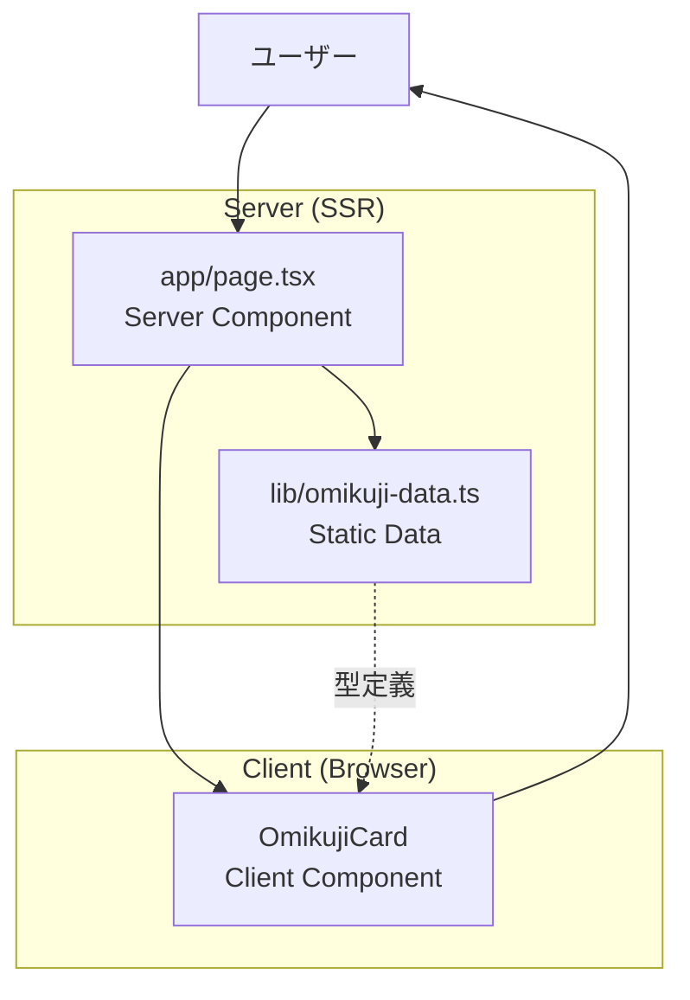
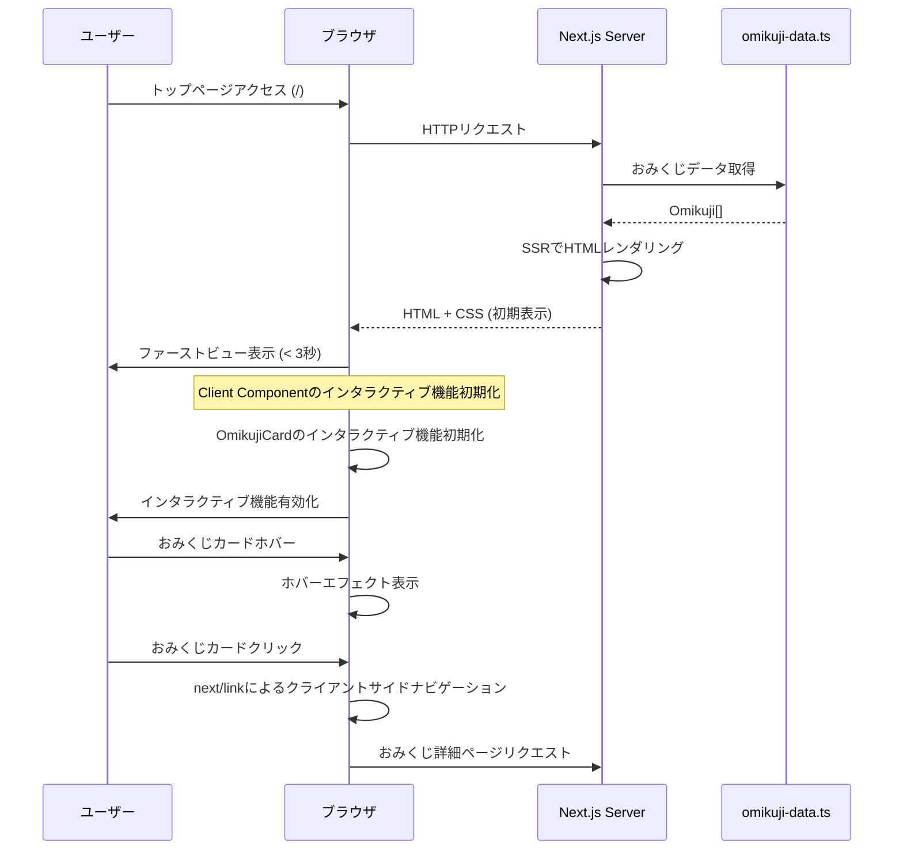
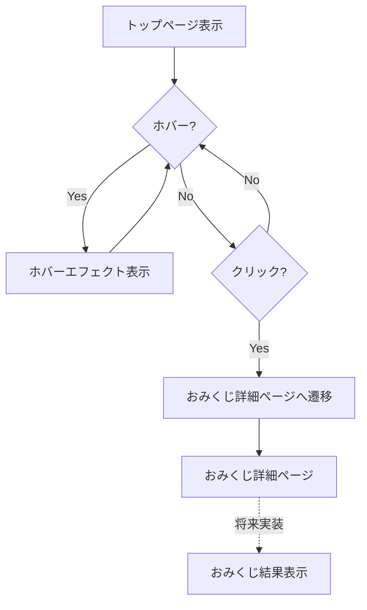
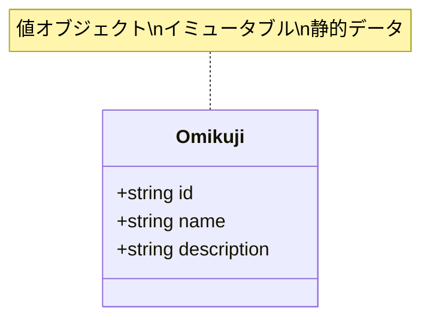

# Design Document - トップページ

## Overview
本設計は、エンジニア向けおみくじアプリケーションのトップページ機能を定義する。トップページは、サービスの価値提案を明確に伝え、利用可能なおみくじ一覧を表示し、各おみくじへのナビゲーションを提供する最初の接点となる。

**Purpose**: ユーザーに対してサービスの目的を即座に理解させ、おみくじ選択への導線を提供することで、シームレスなユーザー体験を実現する。

**Users**: ソフトウェアエンジニアが主要なターゲットユーザーであり、認証なしで気軽にアクセスし、業務における運勢を占うために利用する。

**Impact**: 既存の`app/page.tsx`（Next.jsデフォルトページ）を置き換え、アプリケーションのエントリーポイントとしてブランド化されたトップページを提供する。

### Goals
- サービスの概要と目的を視覚的に明確に伝える
- 利用可能なおみくじの一覧を見やすく表示する
- 各おみくじへの直感的なナビゲーションを提供する
- デスクトップとモバイルの両方で快適な閲覧体験を実現する
- 3秒以内の高速な初期表示とアクセシビリティを確保する

### Non-Goals
- おみくじ詳細ページの実装（別仕様で対応）
- おみくじ結果の表示機能（詳細ページで対応）
- ユーザー認証・ログイン機能（プロダクト方針により不要）
- おみくじデータの動的管理機能（初期段階では静的データで十分）
- ユーザー履歴・お気に入り機能（将来検討）

## Architecture

### Existing Architecture Analysis
現在のアプリケーションはNext.js 16.1.1のApp Routerを使用したシンプルな構成である。

**Current Patterns**:
- Next.js App Router（`app/`ディレクトリ）によるファイルベースルーティング
- Server Componentsをデフォルトとするレンダリング戦略
- Tailwind CSS 4によるユーティリティファーストスタイリング
- Geist Sans/Monoフォントの自動最適化ロード
- TypeScript strict modeによる型安全性

**Integration Points**:
- `app/layout.tsx` - ルートレイアウト、フォント設定、メタデータ（変更なし）
- `app/page.tsx` - 現在のホームページ（**完全置き換え対象**）
- `app/globals.css` - グローバルスタイル、Tailwind設定（変更なし）

**Constraints Preserved**:
- Server Components Firstプリンシプルの維持
- TypeScript strict modeの遵守
- Tailwind CSSスタイリングの一貫性
- 既存のダークモード対応の継続

### Architecture Pattern & Boundary Map

**Selected Pattern**: Hybrid Server/Client Component Architecture

**Domain Boundaries**:
- **Presentation Layer** (`app/page.tsx`) - Server Component、ページ全体のレイアウトとデータ提供
- **UI Component Layer** (`app/components/`) - Client Component（インタラクティブ要素のみ）
- **Data Layer** (`lib/omikuji-data.ts`) - 型定義とデータソース



**Architecture Integration**:
- **Selected Pattern**: Hybrid Server/Client Architecture - ページ全体はServer Componentとして高速レンダリングし、ホバーエフェクトなどのインタラクティブ要素のみClient Component化
- **Domain Boundaries**: データ層（`lib/`）、プレゼンテーション層（`app/page.tsx`）、UI層（`app/components/`）の3層構造で責任を分離
- **Existing Patterns Preserved**: Server Components First、TypeScript strict mode、Tailwind CSSによるスタイリング
- **New Components Rationale**: `OmikujiCard`のみClient Component化することで、SSRの利点を最大限維持しつつインタラクティブ性を実現
- **Steering Compliance**: steering/tech.mdの「Server Components First」およびsteering/structure.mdの「Flat Structure」原則に準拠

### Technology Stack

| Layer | Choice / Version | Role in Feature | Notes |
|-------|------------------|-----------------|-------|
| Frontend / CLI | Next.js 16.1.1 | ページレンダリング、ルーティング、SSR | App Router使用、既存バージョン維持 |
| Frontend / CLI | React 19.2.3 | UIコンポーネント、インタラクティブ機能 | Server/Client Components両対応 |
| Frontend / CLI | TypeScript 5.x (strict) | 型安全性、開発体験向上 | strict mode必須、既存設定維持 |
| Frontend / CLI | Tailwind CSS 4 | レスポンシブスタイリング、デザインシステム | v4の`@theme inline`構文使用 |
| Frontend / CLI | Geist Sans/Mono | フォントファミリー | next/fontによる自動最適化、既存設定維持 |

すべての技術選択は既存スタックとの整合性を保ち、新規依存関係の追加なしで実装可能。詳細な技術検証とトレードオフは`research.md`を参照。

## System Flows

### ページロードとレンダリングフロー



**Key Decisions**:
- Server Componentによる初期HTMLレンダリングで3秒以内のファーストビュー達成（Requirement 5.1）
- Client Componentのインタラクティブ機能初期化はファーストビュー後に非同期実行し、初期表示をブロックしない
  - **インタラクティブ機能初期化とは**: サーバーが生成した静的HTMLページに対して、ブラウザ側でJavaScriptを実行し、ボタンのクリックやホバーエフェクトなどの動的機能を有効化するプロセス。最初はページの見た目だけが表示され、その後にインタラクティブな機能が追加される
- `next/link`によるプリフェッチとクライアントサイドナビゲーションでシームレスな遷移

### ナビゲーションフロー



## Requirements Traceability

| Requirement | Summary | Components | Interfaces | Flows |
|-------------|---------|------------|------------|-------|
| 1.1 | サービス名表示 | TopPage (app/page.tsx) | JSX (Header) | Page Load Flow |
| 1.2 | サービス目的説明 | TopPage (app/page.tsx) | JSX (Description) | Page Load Flow |
| 1.3 | エンジニア特化デザイン要素 | TopPage (app/page.tsx) | CSS (Tailwind classes) | Page Load Flow |
| 2.1 | おみくじ一覧リスト表示 | TopPage, omikuji-data.ts | Omikuji[], JSX (Grid) | Page Load Flow |
| 2.2 | おみくじ名称表示 | OmikujiCard | OmikujiCardProps | Page Load Flow |
| 2.3 | おみくじ説明表示 | OmikujiCard | OmikujiCardProps | Page Load Flow |
| 2.4 | 空状態メッセージ表示 | TopPage (app/page.tsx) | JSX (Conditional) | Page Load Flow |
| 3.1 | クリック可能要素 | OmikujiCard | onClick handler | Navigation Flow |
| 3.2 | 詳細ページ遷移 | OmikujiCard, next/link | next/link href | Navigation Flow |
| 3.3 | ホバーエフェクト | OmikujiCard | onMouseEnter/Leave, CSS | Navigation Flow |
| 4.1 | デスクトップレイアウト | TopPage, OmikujiCard | Tailwind md: classes | Page Load Flow |
| 4.2 | モバイルレイアウト | TopPage, OmikujiCard | Tailwind responsive | Page Load Flow |
| 4.3 | レスポンシブ再調整 | TopPage, OmikujiCard | CSS media queries | Page Load Flow |
| 5.1 | 3秒以内ロード | TopPage (Server Component) | SSR | Page Load Flow |
| 5.2 | セマンティックHTML | TopPage, OmikujiCard | nav, main, article | Page Load Flow |
| 5.3 | キーボードナビゲーション | OmikujiCard, next/link | tabIndex, Enter key | Navigation Flow |
| 5.4 | 画像alt属性 | TopPage | img alt | Page Load Flow |
| 6.1 | app/page.tsx実装 | TopPage | Next.js Page | - |
| 6.2 | TypeScript strict mode | All components | TypeScript interfaces | - |
| 6.3 | Tailwind CSSスタイリング | TopPage, OmikujiCard | className | - |
| 6.4 | Server Component実装 | TopPage | export default | Page Load Flow |
| 6.5 | Metadata API使用 | TopPage | export metadata | Page Load Flow |

## Components and Interfaces

| Component | Domain/Layer | Intent | Req Coverage | Key Dependencies (P0/P1) | Contracts |
|-----------|--------------|--------|--------------|--------------------------|-----------|
| TopPage | Presentation | トップページのメインコンテナ、おみくじ一覧レンダリング | 1.1, 1.2, 1.3, 2.1, 2.4, 4.1, 4.2, 5.1, 5.2, 6.1, 6.4, 6.5 | omikuji-data (P0), OmikujiCard (P0) | State |
| OmikujiCard | UI Component | おみくじカード表示、ホバーエフェクト、ナビゲーション | 2.2, 2.3, 3.1, 3.2, 3.3, 4.1, 4.2, 5.3 | next/link (P0) | Props Interface |
| omikuji-data | Data Layer | おみくじデータと型定義の提供 | 2.1, 2.2, 2.3, 6.2 | None | Type Definition |

### Presentation Layer

#### TopPage

| Field | Detail |
|-------|--------|
| Intent | トップページ全体のレイアウト、サービス概要、おみくじ一覧の表示 |
| Requirements | 1.1, 1.2, 1.3, 2.1, 2.4, 4.1, 4.2, 5.1, 5.2, 6.1, 6.4, 6.5 |
| Owner / Reviewers | - |

**Responsibilities & Constraints**
- サービス名、説明、ブランディング要素の表示
- おみくじデータの取得と一覧レンダリング
- レスポンシブレイアウトの制御（デスクトップ: グリッド3列、モバイル: 1列）
- セマンティックHTML構造の維持
- Server Componentとして実装し、SSRによる高速初期表示を実現
- おみくじデータが空の場合の適切なメッセージ表示

**Dependencies**
- Inbound: なし（ルートページ）
- Outbound: omikuji-data.ts - おみくじデータ取得 (P0 - ページ表示に必須)
- Outbound: OmikujiCard - おみくじカードコンポーネント (P0 - 一覧表示に必須)
- External: next/metadata - ページメタデータ設定 (P1 - SEO最適化)

**Contracts**: State [x]

##### State Management
- **State Model**: Server Componentのため、状態管理は不要。おみくじデータは静的インポートで取得
- **Persistence & Consistency**: データは`omikuji-data.ts`で静的に管理され、ビルド時に確定
- **Concurrency Strategy**: SSRのため同時実行制御は不要

**Implementation Notes**
- **Integration**: `app/page.tsx`を完全置き換え。`app/layout.tsx`は変更なし
- **Validation**: おみくじデータ配列の長さチェックで空状態を判定
- **Risks**: おみくじ詳細ページ未実装時は404エラー（初期段階では許容、タスク分割で対応）

### UI Component Layer

#### OmikujiCard

| Field | Detail |
|-------|--------|
| Intent | 個別おみくじの表示、ホバーエフェクト、クリックナビゲーション |
| Requirements | 2.2, 2.3, 3.1, 3.2, 3.3, 4.1, 4.2, 5.3 |
| Owner / Reviewers | - |

**Responsibilities & Constraints**
- おみくじの名称と説明を視覚的に表示
- マウスホバー時の視覚的フィードバック（背景色変化、影、トランジション）
- クリック時のおみくじ詳細ページへのナビゲーション
- キーボード操作（Tab、Enter）による操作サポート
- レスポンシブなカードレイアウト（モバイル/デスクトップ）
- Client Componentとして実装（ホバーエフェクトのため）

**Dependencies**
- Inbound: TopPage - おみくじデータを受け取る (P0)
- Outbound: next/link - ナビゲーション実装 (P0 - クリック遷移に必須)
- External: React - useState（ホバー状態管理用） (P0)

**Contracts**: Props Interface [x]

##### Props Interface
```typescript
interface OmikujiCardProps {
  id: string;          // おみくじID（URLスラッグとして使用）
  name: string;        // おみくじ名称（表示用）
  description: string; // おみくじ説明（表示用）
}
```
- **Preconditions**:
  - `id`は一意であり、URL-safeな文字列（英数字とハイフンのみ）
  - `name`と`description`は空文字列でない
- **Postconditions**:
  - カードがクリックされた場合、`/omikuji/{id}`へナビゲート
  - ホバー時に視覚的フィードバックが表示される
- **Invariants**:
  - `id`は変更されない（Reactのkey属性として使用）

**Implementation Notes**
- **Integration**: TopPageから`map`で繰り返しレンダリング。`key={omikuji.id}`を設定
- **Validation**: TypeScript strict modeにより型検証。Propsの存在は親コンポーネントで保証
- **Risks**: おみくじ詳細ページ未実装時は404エラー（初期段階では許容）

### Data Layer

#### omikuji-data

| Field | Detail |
|-------|--------|
| Intent | おみくじデータと型定義の提供 |
| Requirements | 2.1, 2.2, 2.3, 6.2 |
| Owner / Reviewers | - |

**Responsibilities & Constraints**
- `Omikuji`型インターフェースの定義
- 初期おみくじデータセットの提供
- TypeScript strict modeによる型安全性の保証
- 将来的なデータソース変更への拡張性確保（JSON/API移行）

**Dependencies**
- Inbound: TopPage - データ消費 (P0)
- Outbound: なし
- External: なし

**Contracts**: Type Definition [x]

##### Type Definition

> **注意**: このデータモデルは初期実装のための仮のモデルです。将来的な拡張性を考慮し、以下の追加フィールドが検討される可能性があります：
> - `icon`: おみくじのアイコンパス
> - `category`: カテゴリ分類（業務、コミュニケーション、技術など）
> - `difficulty`: 難易度や重要度
> - `metadata`: 拡張用メタデータ（作成日時、タグ、表示順序など）

```typescript
interface Omikuji {
  id: string;          // 一意識別子、URL-safe
  name: string;        // 表示名（例: "今日の運勢"）
  description: string; // 簡潔な説明（50文字程度）
  // 将来追加される可能性: icon, category, difficulty, metadata
}

const omikujiList: readonly Omikuji[] = [
  // 初期データセット
];

export { type Omikuji, omikujiList };
```
- **Preconditions**:
  - すべての`id`はユニーク
  - `name`と`description`は非空文字列
- **Postconditions**:
  - `omikujiList`はイミュータブル（`readonly`）
- **Invariants**:
  - 配列は常に`Omikuji`型のオブジェクトのみを含む

**Implementation Notes**
- **Integration**: `app/page.tsx`で`import { omikujiList } from '@/lib/omikuji-data'`としてインポート
- **Validation**: TypeScript strict modeによる静的検証
- **Risks**: データ更新にはコード変更とデプロイが必要（初期段階では許容、将来的にJSON/API化を検討）

## Data Models

### Domain Model

> **設計上の注意**: 以下のデータモデルは初期実装のための最小構成です。将来的にはアイコン、カテゴリ分類、メタデータなどのフィールド追加が想定されます。拡張時には型定義の後方互換性を維持します。

**Aggregates**:
- **Omikuji**: おみくじの基本情報を表す値オブジェクト（集約ルート）

**Entities & Value Objects**:
- `Omikuji` - 値オブジェクト（id, name, descriptionで一意に識別）
  - 現行: 最小限の3フィールド（id, name, description）
  - 将来想定: icon, category, difficulty, metadata等の追加

**Business Rules**:
- おみくじIDは一意であり、URL-safeな文字列（英数字、ハイフン、アンダースコアのみ）
- おみくじ名称と説明は必須項目
- おみくじ一覧は読み取り専用（静的データ）

**Invariants**:
- おみくじIDの一意性を保証
- すべてのおみくじは名称と説明を持つ



### Logical Data Model

**Structure Definition**:
- **Omikuji**:
  - `id`: string（主キー、一意）
  - `name`: string（NOT NULL）
  - `description`: string（NOT NULL）

**Consistency & Integrity**:
- トランザクション境界: なし（静的データ）
- 整合性: TypeScript型システムによる静的保証
- 時系列: 変更履歴なし（将来的にバージョン管理が必要な場合は別途考慮）

### Data Contracts & Integration

**API Data Transfer**:
現段階ではAPIは使用しないが、将来的なAPI化を考慮した型定義を維持。

```typescript
// 将来のAPI契約（参考）
type GetOmikujiListResponse = {
  omikujiList: Omikuji[];
  total: number;
};
```

**Cross-Service Data Management**:
- 現在は単一サービス内で完結
- 将来的におみくじ結果の保存が必要な場合、別サービスとの統合を検討

## Error Handling

### Error Strategy
トップページは静的データ表示が主体であるため、エラーハンドリングは最小限。主なエラーシナリオは以下の通り。

### Error Categories and Responses

**User Errors (4xx)**:
- **404 Not Found（おみくじ詳細ページ未実装）**:
  - **Condition**: ユーザーがおみくじカードをクリックし、詳細ページが未実装の場合
  - **Response**: Next.jsの標準404ページを表示
  - **Mitigation**: 詳細ページ実装までの暫定対応として、カード下部に「準備中」バッジを表示（optional）

**System Errors (5xx)**:
- **SSRレンダリングエラー**:
  - **Condition**: `omikuji-data.ts`のインポートエラーまたは型不一致
  - **Response**: Next.jsのエラーバウンダリで500エラーページを表示
  - **Prevention**: TypeScript strict modeによる事前検証、ビルド時エラーチェック

**Business Logic Errors**:
- **おみくじデータ空配列**:
  - **Condition**: `omikujiList.length === 0`
  - **Response**: 「準備中です。しばらくお待ちください。」メッセージを表示
  - **Implementation**: 条件分岐で空状態UIをレンダリング

### Monitoring
- Next.js標準のビルドエラーログによる事前検証
- ブラウザコンソールでのクライアントサイドエラー監視
- 将来的にはSentry等のエラートラッキングツール導入を検討

## Testing Strategy

### Unit Tests
1. **omikuji-data.ts型定義テスト** - `Omikuji`型が正しく定義され、`omikujiList`が型に準拠しているか
2. **OmikujiCard Propsバリデーション** - 必須Props（id, name, description）が正しく渡されるか
3. **空配列ハンドリング** - `omikujiList`が空の場合に適切なメッセージが表示されるか

### Integration Tests
1. **TopPage + OmikujiCardレンダリング** - おみくじ一覧が正しくカードコンポーネントとしてレンダリングされるか
2. **ナビゲーション統合** - OmikujiCardクリック時に`next/link`が正しく動作するか
3. **レスポンシブレイアウト** - 画面幅変更時にグリッドレイアウトが適切に調整されるか

### E2E/UI Tests
1. **初期ロードパフォーマンス** - ページアクセスから3秒以内にファーストビューが表示されるか（Lighthouse測定）
2. **ホバーエフェクト** - マウスホバー時に視覚的フィードバックが表示されるか
3. **キーボードナビゲーション** - Tabキーでフォーカス移動、Enterキーでナビゲーションが可能か
4. **モバイル表示** - モバイルデバイスで一覧が縦1列で正しく表示されるか

### Performance/Load
1. **SSRレンダリング時間** - おみくじ数が増加した場合のSSRパフォーマンス（50件まで想定）
2. **Client Componentインタラクティブ機能初期化時間** - OmikujiCardのインタラクティブ機能初期化がファーストビューをブロックしないか
3. **Core Web Vitals** - LCP < 2.5s、FID < 100ms、CLS < 0.1を満たすか

## Optional Sections

### Performance & Scalability

**Target Metrics**:
- **LCP (Largest Contentful Paint)**: < 2.5秒
- **FID (First Input Delay)**: < 100ms
- **CLS (Cumulative Layout Shift)**: < 0.1
- **Time to First Byte (TTFB)**: < 600ms

**Optimization Techniques**:
- Server Componentによる初期HTMLレンダリング（JavaScript実行不要）
- 静的データのビルド時最適化
- Tailwind CSSのPurge機能による未使用スタイル削除
- next/fontによるフォント最適化（自動サブセット化）
- next/linkによるプリフェッチ（viewport内のリンクを先読み）

**Scaling Approach**:
- おみくじデータが50件程度まではSSRで対応可能
- それ以上増加する場合は、ページネーションまたは無限スクロールを検討
- 将来的にISR（Incremental Static Regeneration）への移行を検討

### Security Considerations

**Threat Mitigation**:
- **XSS対策**: Reactのデフォルトエスケープにより、おみくじ名称・説明のXSSを防止
- **CSRF対策**: トップページは読み取り専用のため、CSRF攻撃のリスクなし
- **Injection対策**: 静的データのため、SQLインジェクション等のリスクなし

**Data Protection**:
- おみくじデータは公開情報のため、特別なデータ保護は不要
- 将来的にユーザー履歴機能を追加する場合は、個人情報保護を考慮

**Compliance**:
- アクセシビリティ基準（WCAG 2.1 Level AA）に準拠
- OGPタグによるSNSシェア対応

## Supporting References

### 詳細な型定義例

> **注**: このインターフェースは初期実装用の仮のモデルです。将来的にフィールドが追加される可能性があります。

```typescript
// lib/omikuji-data.ts の完全な実装例（初期バージョン）
export interface Omikuji {
  id: string;          // 必須: 一意識別子
  name: string;        // 必須: 表示名
  description: string; // 必須: 説明文
  // 将来追加予定: icon?, category?, difficulty?, metadata?
}

export const omikujiList: readonly Omikuji[] = [
  {
    id: 'daily-luck',
    name: '今日の運勢',
    description: '今日1日の業務運を占います',
  },
  {
    id: 'code-review',
    name: 'コードレビュー運',
    description: 'レビューの厳しさを占います',
  },
  {
    id: 'bug-encounter',
    name: 'バグ遭遇運',
    description: '今日のバグ発見確率を占います',
  },
] as const;
```

### レスポンシブグリッドレイアウトのTailwindクラス例

```tsx
{/* デスクトップ: 3列グリッド、モバイル: 1列 */}
<div className="grid grid-cols-1 md:grid-cols-2 lg:grid-cols-3 gap-6">
  {omikujiList.map((omikuji) => (
    <OmikujiCard key={omikuji.id} {...omikuji} />
  ))}
</div>
```

### メタデータ定義例

```typescript
// app/page.tsx
import type { Metadata } from 'next';

export const metadata: Metadata = {
  title: 'エンジニアおみくじ - 今日の運勢を占おう',
  description: 'ソフトウェアエンジニア向けのおみくじアプリ。業務における運勢を気軽に占えます。',
  openGraph: {
    title: 'エンジニアおみくじ',
    description: 'ソフトウェアエンジニア向けの運勢占い',
    type: 'website',
  },
};
```
